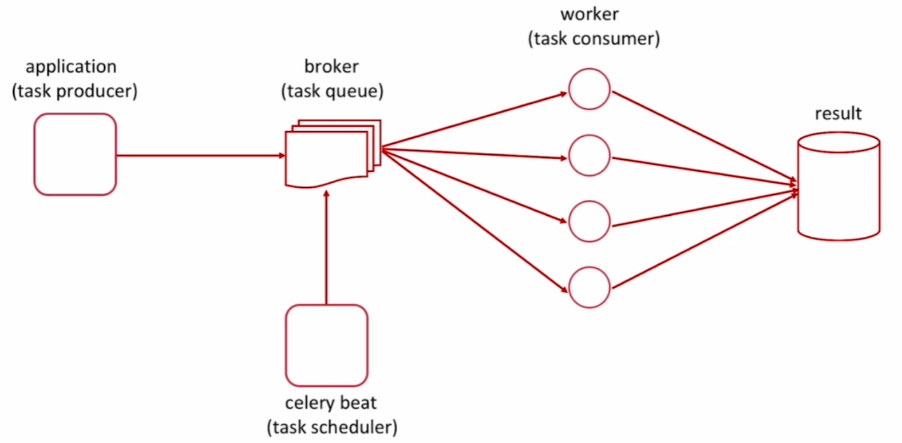

# Celery基本介绍

## 基本模式



1. **生产者：** 生产消息，交给任务队列
2. **任务队列：**（可以用`redis`实现）,负责存储任务
3. **消费者：** 负责消费消息
   - worker
   - celery beat
4. **存储：** 使用之后将结果存储到result里面

## 使用场景

1. 异步任务：将耗时操作任务提交给Celery去异步执行（发送短信、消息推送、音视频处理等等）
2. 定时任务：类似于crontab，比如每日数据统计

# Celery安装和环境配置

可以使用RabbitMQ或者Redis来作为消息队列

## 环境配置

`conda`和`virtualenv`都可以配置虚拟环境，区别如下(建议使用conda)

| 特性         | virtualenv/venv                        | conda                     |
| :----------- | :------------------------------------- | :------------------------ |
| **存储位置** | 项目目录内                             | 集中统一位置              |
| **项目目录** | 会有环境文件夹                         | 保持干净                  |
| **环境管理** | 分散在各个项目                         | 集中管理                  |
| **磁盘空间** | 可能重复占用                           | 可共享基础包              |
| **激活方式** | `.\venv_filebox_name\Scripts\activate` | `conda activate env_name` |

1. 配置虚拟环境：
   - ` pip install virtualenv`
   - 使用`conda`来完成
2. 新建一个环境：
   - `virtualenv env4mooc`
   - `conda create -n celery_env python=3.9`
3. 查看现有环境列表：`conda info --envs`
4. 进入虚拟环境：
   - `.\venv_filebox_name\Scripts\activate`
   - `conda activate celery_env`
5. 在虚拟环境中安装依赖：
   - 消息队列:`pip install celery`
   - 含消息代理（Message Broker）的安装：`pip install celery[redis]`
6. 在虚拟环境中查看存在的依赖列表：`pip list`
7. 退出当前虚拟环境
   - `conda`环境：`conda deactivate`
   - `virtualenv/venv` 环境: `deactivate`

# Celery的使用

## 基本使用

### 顺序调用

对于一个按照顺序执行的函数调用

```python
import time

def add(x, y):
    print('enter call function')
    time.sleep(4)
    return x + y

if __name__ == '__main__':
    print('start task...')
    result = add(2, 3)
    print('end task...')
    print(result)
    
#start task...
#enter call function
#end task...
#5
```


## 配置文件


## 定时任务


# Django 结合 Celery


# 部署与监控


# 总结回顾