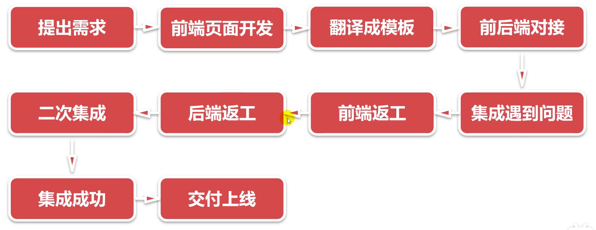
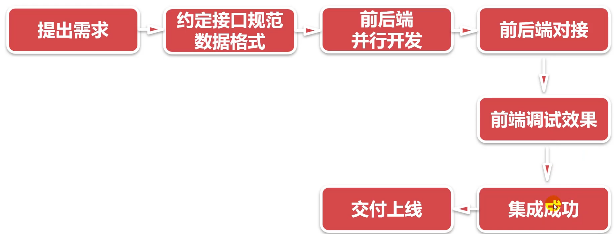
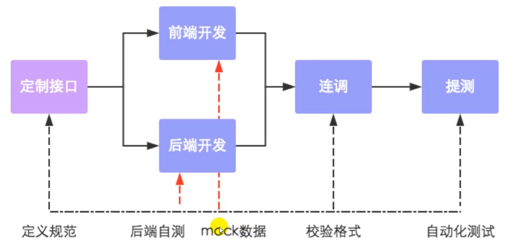
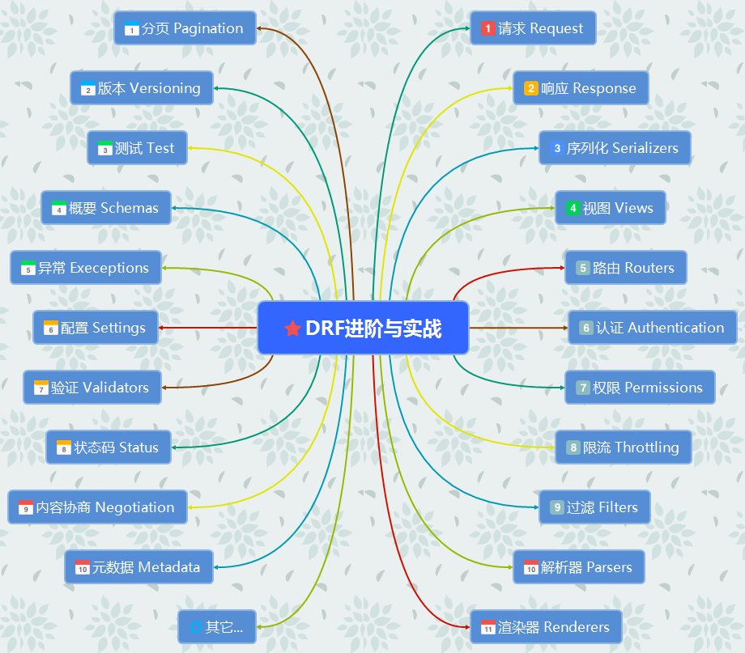

# 前置知识

## 学习重点

在我们学习了Django的基本框架之后，对于基础的文件作用和项目开发有了一定的了解。下面这部分内容，我们就着重关注Restful API接口的开发，也就是纯后端的接口，以便与我们项目的前端进行对接。这部分更加复杂和规范，和Java的三层架构以及Gin的开发有一定的相似之处，主要是下面这几部分：

1. 模型类如何序列化（serializers）
2. DRF的视图集有那些类，该如何选择（`viewsets`）
3. 路由（routers）
4. 认证（authentication）
5. 权限（permission）

而且我们会顺便了解听过很久但是没有使用过的Postman（用`apifox`和插件的鼠鼠我又学到新东西了）

## 前后端分离

1. **交互形式：**前端展示在用户的设备上，后端运行在服务器上用于向前端提供对应的业务逻辑和数据。后端只需要提供对应的RESTful API接口以及约定好的`Json`、`XML`等格式的数据给前端即可；前端通过不同的Http方法向后端请求数据并且渲染出页面。RESTful API是一种约定好的方式

2. **代码组织方式：**前后端不分离（写temple模板的html页面），前后端半分离，前后端分离（可以部署在不同的服务器上，解耦比较彻底）

3. **开发模式：**

   - 前后端不分离：

     
     
   - 前后端分离：

     

4. 数据接口规范流程：

   

## 什么是RESTful API

### 最佳实践

什么是RESTful API的最佳实践（前五个加中的是必要的）：

1. **协议**：使用HTTPS协议，确保数据传输的安全性。

2. **域名**：应将API部署在专用域名下（如`https://api.example.com`）或主域名下（如`https://example.com/api/`）。

3. **版本**：在URL或请求头中明确标识API版本（如`https://api.example.com/v1/`或使用Accept头`Accept: application/vnd.example.v1+json`）。

4. **路径**：使用名词的复数形式表示资源端点（如`/users`、`/products`），避免在端点中使用动词。

5. **HTTP动词**：使用标准的HTTP方法表示操作意图（GET获取资源、POST创建资源、PUT更新资源、PATCH部分更新、DELETE删除资源）。

6. 过滤信息：使用查询参数对返回结果进行过滤、排序、搜索和分页（如`?limit=10&offset=20&sort=name&status=active`）。

7. 状态码：使用恰当的HTTP状态码表示请求结果（200成功、201创建成功、400客户端错误、404资源不存在、500服务器错误）。

8. 错误处理：错误响应应包含清晰的错误信息、错误代码和详细说明，格式统一（如`{"error": {"code": "invalid_param", "message": "参数无效"}}`）。

9. 返回结果：针对不同操作返回符合预期的结果（GET返回资源对象、POST返回新创建的资源、DELETE返回空 body），使用JSON格式。

10. Hypermedia API：在响应中提供相关资源的链接（HATEOAS），使客户端能够发现和导航API（如`{"user": {...}, "links": {"self": "/users/123", "posts": "/users/123/posts"}}`）。

### 详细介绍

下面是复制的详细介绍（[深入理解什么是RESTful API_慕课手记](https://www.imooc.com/article/304756)）：

**一、协议**

API与用户的通信协议，总是使用[HTTPs协议](http://www.ruanyifeng.com/blog/2014/02/ssl_tls.html)。

**二、域名**

应该尽量将API部署在专用域名之下。

```http
https://api.example.com
```

如果确定API很简单，不会有进一步扩展，可以考虑放在主域名下。

```http
https://example.org/api/
```

**三、版本（Versioning）**

应该将API的版本号放入URL。

```http
https://api.example.com/v1/
```

另一种做法是，将版本号放在HTTP头信息中，但不如放入URL方便和直观。[Github](https://developer.github.com/v3/media/#request-specific-version)采用这种做法。

**四、路径（Endpoint）**

路径又称"终点"（endpoint），表示API的具体网址。

在RESTful架构中，每个网址代表一种资源（resource），所以网址中不能有动词，只能有名词，而且所用的名词往往与数据库的表格名对应。一般来说，数据库中的表都是同种记录的"集合"（collection），所以API中的名词也应该使用复数。

举例来说，有一个API提供动物园（zoo）的信息，还包括各种动物和雇员的信息，则它的路径应该设计成下面这样。

```http
https://api.example.com/v1/zoos
https://api.example.com/v1/animals
https://api.example.com/v1/employees
```

**五、HTTP动词**

对于资源的具体操作类型，由HTTP动词表示。
常用的HTTP动词有下面五个（括号里是对应的SQL命令）。

```http
GET（SELECT）：从服务器取出资源（一项或多项）。
POST（CREATE）：在服务器新建一个资源。
PUT（UPDATE）：在服务器更新资源（客户端提供改变后的完整资源）。//全部更新
PATCH（UPDATE）：在服务器更新资源（客户端提供改变的属性）。//部分更新
DELETE（DELETE）：从服务器删除资源。
```

还有两个不常用的HTTP动词。

```http
HEAD：获取资源的元数据。
OPTIONS：获取信息，关于资源的哪些属性是客户端可以改变的。
```

下面是一些例子。

```http
GET /zoos：列出所有动物园
POST /zoos：新建一个动物园
GET /zoos/ID：获取某个指定动物园的信息
PUT /zoos/ID：更新某个指定动物园的信息（提供该动物园的全部信息）
PATCH /zoos/ID：更新某个指定动物园的信息（提供该动物园的部分信息）
DELETE /zoos/ID：删除某个动物园
GET /zoos/ID/animals：列出某个指定动物园的所有动物
DELETE /zoos/ID/animals/ID：删除某个指定动物园的指定动物
```

**六、过滤信息（Filtering）**

如果记录数量很多，服务器不可能都将它们返回给用户。API应该提供参数，过滤返回结果。
下面是一些常见的参数。

```http
?limit=10：指定返回记录的数量
?offset=10：指定返回记录的开始位置。
?page=2&per_page=100：指定第几页，以及每页的记录数。
?sortby=name&order=asc：指定返回结果按照哪个属性排序，以及排序顺序。
?animal_type_id=1：指定筛选条件
```

参数的设计允许存在冗余，即允许API路径和URL参数偶尔有重复。比如，GET /zoo/ID/animals 与 GET /animals?zoo_id=ID 的含义是相同的。

**七、状态码（Status Codes）**

服务器向用户返回的状态码和提示信息，常见的有以下一些（方括号中是该状态码对应的HTTP动词）。

```http
200 OK - [GET]：服务器成功返回用户请求的数据，该操作是幂等的（Idempotent）。
201 CREATED - [POST/PUT/PATCH]：用户新建或修改数据成功。
202 Accepted - [*]：表示一个请求已经进入后台排队（异步任务）
204 NO CONTENT - [DELETE]：用户删除数据成功。
400 INVALID REQUEST - [POST/PUT/PATCH]：用户发出的请求有错误，服务器没有进行新建或修改数据的操作，该操作是幂等的。
401 Unauthorized - [*]：表示用户没有权限（令牌、用户名、密码错误）。
403 Forbidden - [*] 表示用户得到授权（与401错误相对），但是访问是被禁止的。
404 NOT FOUND - [*]：用户发出的请求针对的是不存在的记录，服务器没有进行操作，该操作是幂等的。
406 Not Acceptable - [GET]：用户请求的格式不可得（比如用户请求JSON格式，但是只有XML格式）。
410 Gone -[GET]：用户请求的资源被永久删除，且不会再得到的。
422 Unprocesable entity - [POST/PUT/PATCH] 当创建一个对象时，发生一个验证错误。
500 INTERNAL SERVER ERROR - [*]：服务器发生错误，用户将无法判断发出的请求是否成功。
```

状态码的完全列表参见[这里](http://www.w3.org/Protocols/rfc2616/rfc2616-sec10.html)。

**八、错误处理（Error handling）**

如果状态码是4xx，就应该向用户返回出错信息。一般来说，返回的信息中将error作为键名，出错信息作为键值即可。

```json
{
error: "Invalid API key"
}
```

**九、返回结果**

针对不同操作，服务器向用户返回的结果应该符合以下规范。

```http
GET /collection：返回资源对象的列表（数组）
GET /collection/resource：返回单个资源对象
POST /collection：返回新生成的资源对象
PUT /collection/resource：返回完整的资源对象
PATCH /collection/resource：返回完整的资源对象
DELETE /collection/resource：返回一个空文档
```

**十、Hypermedia API**

RESTful API最好做到Hypermedia，即返回结果中提供链接，连向其他API方法，使得用户不查文档，也知道下一步应该做什么。
　　比如，当用户向api.example.com的根目录发出请求，会得到这样一个文档。

```json
{"link": { 
  "rel":   "collection https://www.example.com/zoos",
  "href":  "https://api.example.com/zoos",
  "title": "List of zoos",
  "type":  "application/vnd.yourformat+json"}}
```

上面代码表示，文档中有一个link属性，用户读取这个属性就知道下一步该调用什么API了。rel表示这个API与当前网址的关系（collection关系，并给出该collection的网址），href表示API的路径，title表示API的标题，type表示返回类型。
　　Hypermedia API的设计被称为[HATEOAS](http://en.wikipedia.org/wiki/HATEOAS)。Github的API就是这种设计，访问[api.github.com](https://api.github.com/)会得到一个所有可用API的网址列表。

```json
{
  "current_user_url": "https://api.github.com/user",
  "authorizations_url": "https://api.github.com/authorizations",
  // ...}
```

从上面可以看到，如果想获取当前用户的信息，应该去访问[api.github.com/user](https://api.github.com/user)，然后就得到了下面结果。

```json
  {
    "message": "Requires authentication",
    "documentation_url": "https://developer.github.com/v3"}
```

上面代码表示，服务器给出了提示信息，以及文档的网址。

**十一、其他**

（1）API的身份认证应该使用[OAuth 2.0](http://www.ruanyifeng.com/blog/2014/05/oauth_2_0.html)框架。
（2）服务器返回的数据格式，应该尽量使用JSON，避免使用XML。

## 开发环境搭建

### 项目环境

我们重新回忆一下创建完项目之后的流程：

1. settings.py

   ```python
   # 在创建项目的时候就创建了一个APP，因此不需要修改INSTALLED_APPS
   
   # 语言与时间
   LANGUAGE_CODE = "zh-hans"
   TIME_ZONE = "Asia/Shanghai"
   USE_I18N = True
   USE_TZ = False
   
   # 新增了前端目录（注意要自建一个static文件夹）
   STATIC_URL = "static/"
   STATIC_ROOT = os.path.join(BASE_DIR, "static")
   STATICFILES_DIRS = [
       os.path.join(BASE_DIR, "static"),
   ]
   ```

2. 创建数据表migration

### DRF环境

#### 可选依赖包

- [PyYAML](https://pypi.org/project/PyYAML/)， [uritemplate](https://pypi.org/project/uritemplate/) （5.1+， 3.0.0+） - 模式生成支持。
- [Markdown](https://pypi.org/project/Markdown/) （3.3.0+） - 对可浏览 API 的 Markdown 支持。
- [Pygments](https://pypi.org/project/Pygments/) （2.7.0+） - 为 Markdown 处理添加语法突出显示。
- [django-filter](https://pypi.org/project/django-filter/) （1.0.1+） - 过滤支持。
- [django-guardian](https://github.com/django-guardian/django-guardian) （1.1.1+） - 对象级权限支持。

#### 配置方式

教程如下：[首页 - Django REST 框架](https://www.django-rest-framework.org/)

1. 创建一个`requirement.txt`来标明依赖

   ```
   asgiref==3.2.7
   certifi==2020.4.5.1
   chardet==3.0.4
   coreapi==2.3.3
   coreschema==0.0.4
   Django==3.0.6
   django-filter==2.2.0
   djangorestframework==3.11.0
   idna==2.9
   importlib-metadata==1.6.0
   itypes==1.2.0
   Jinja2==2.11.2
   Markdown==3.2.2
   MarkupSafe==1.1.1
   Pygments==2.6.1
   pytz==2020.1
   requests==2.23.0
   sqlparse==0.3.1
   uritemplate==3.0.1
   urllib3==1.25.9
   zipp==3.1.0
   ```

2. 新增`INSTALLED_APPS`内容

   ```py
   INSTALLED_APPS = [
       "django.contrib.admin",
       "django.contrib.auth",
       "django.contrib.contenttypes",
       "django.contrib.sessions",
       "django.contrib.messages",
       "django.contrib.staticfiles",
       'rest_framework', # 用来开发RESTful API
       'rest_framework.authtoken',# DRF自带的Token认证
       'course.apps.CourseConfig',
   ]
   ```

3. 新增字段`REST_FRAMEWORK`

   ```python
   REST_FRAMEWORK = {
       # 默认Schema类 - 用于自动生成API文档
       "DEFAULT_SCHEMA_CLASS": "rest_framework.schemas.coreapi.AutoSchema",
       # 分页设置 - 配置分页类（ES是单复数之分）
       "DEFAULT_PAGINATION_CLASS": 'rest_framework.pagination.PageNumberPagination',
       # 每页显示的数据条数
       'PAGE_SIZE': 50,
       # 日期时间格式 - 定义序列化器中DateTime字段的默认输出格式
       'DATETIME_FORMAT': "%Y-%m-%dT %H:%M:%S",
       
       # 默认渲染器类 - 定义如何将响应数据渲染为特定格式（如JSON、HTML）
       'DEFAULT_RENDERER_CLASSES': [
           'rest_framework.renderers.JSONRenderer',      # 将数据渲染为JSON格式
           'rest_framework.renderers.BrowsableAPIRenderer', # 提供可浏览的API界面（DRF的web界面）
       ],
       
       # 默认解析器类 - 定义如何解析请求中的数据（如JSON、表单数据、文件上传）
       'DEFAULT_PARSER_CLASSES': [
           'rest_framework.parsers.JSONParser',        # 解析JSON格式的请求数据
           'rest_framework.parsers.FormParser',        # 解析表单格式的数据
           'rest_framework.parsers.MultiPartParser',   # 解析文件上传（multipart/form-data）
       ],
       
       # 默认权限类 - 定义全局的访问权限控制
       'DEFAULT_PERMISSION_CLASSES': [
           'rest_framework.permissions.IsAuthenticated',  # 要求用户必须认证后才能访问
       ],
       
       # 默认认证类 - 定义如何认证用户身份（按顺序尝试）
       'DEFAULT_AUTHENTICATION_CLASSES': [
          'rest_framework.authentication.BasicAuthentication',  # HTTP基本认证
          'rest_framework.authentication.SessionAuthentication', # Django session认证
          'rest_framework.authentication.TokenAuthentication',   # Token令牌认证
       ]
   }
   ```

4. `urls.py`中新增路由

   ```python
   from django.contrib import admin
   from django.urls import path, include
   
   urlpatterns = [
       path("api-auth/", include("rest_framework.urls")),# DRF auth urls
       path("admin/", admin.site.urls),
   ]
   ```

#### DRF模块介绍



# 序列化

这部分与数据库关系很密切，下面是我使用数据库时候在设置里面设置的全局DRF字段，这部分在上面的配置部分有详细的说明

```python
DEFAULT_AUTO_FIELD = "django.db.models.BigAutoField"

# DRF的全局配置
REST_FRAMEWORK = {
    'DEFAULT_PERMISSION_CLASS': "rest_framework.pagination.PageNumberPagination",
    'PAGE_SIZE': 50,  # 每页显示的条数
    'DAYTIME_FORMAT': '%Y-%m-%d %H:%M:%S',# 时间格式
    # 渲染器配置 下面这个是默认的配置
    'DEFAULT_RENDERER_CLASSES':[
       'rest_framework.renderers.JSONRenderer', # json格式
       'rest_framework.renderers.BrowsableAPIRenderer', # 浏览器可视化API
    ],
    # 数据解析设置 解析request.data数据
    'DEFAULT_PARSER_CLASSES': [
       'rest_framework.parsers.JSONParser', # json格式
       'rest_framework.parsers.FormParser', # form表单格式
       'rest_framework.parsers.MultiPartParser', # 文件上传格式
    ],
    #权限设置
    'DEFAULT_PERMISSION_CLASSES': [
        'rest_framework.permissions.IsAuthenticated',
    ],
    # 认证设置
    'DEFAULT_AUTHENTICATION_CLASSES': [
        'rest_framework.authentication.BasicAuthentication',
        'rest_framework.authentication.SessionAuthentication',
        'rest_framework.authentication.TokenAuthentication',
    ],
}
```

## 开发模型类

模型类说白了就是一个数据库的表，方便后端程序与数据库的数据交互

```py
from django.db import models

# Create your models here.
from django.db import models
from django.conf import settings

class Counselor(models.Model):
    name = models.CharField(max_length=255, unique=True, help_text="课程名称", verbose_name="名称")
    introduction = models.TextField(help_text="课程简介", verbose_name="简介")
    # 使用外键导入老师
    teacher = models.ForeignKey(settings.AUTH_USER_MODEL, on_delete=models.CASCADE, help_text="授课老师", verbose_name="老师")
    price = models.DecimalField(max_digits=6, decimal_places=2, help_text="课程价格", verbose_name="价格")
    created_at = models.DateTimeField(auto_now_add=True, help_text="创建时间", verbose_name="创建时间")
    updated_at = models.DateTimeField(auto_now=True, help_text="更新时间", verbose_name="更新时间")

    class Meta:
        verbose_name = "课程"
        verbose_name_plural = verbose_name
        ordering = ["price",]

    def __str__(self):
        return self.name
```

## 什么是序列化

序列化就是将数据库中的字段转化成json的形式发送给前端

```python
# 实现序列化
from django import forms
from rest_framework import serializers

from Counselor.models import Counselor

from django.contrib.auth.models import User

class CounselorForm(forms.ModelForm):
    class Meta:
        model = Counselor
        fields = ('name','introduction', 'teacher', 'price')

class UserSerializer(serializers.ModelSerializer):
    class Meta:
        model = User
        fields = '__all__'

# class CounselorSerializer(serializers.ModelSerializer):
#     teacher = serializers.ReadOnlyField(source='teacher.username')#外键字段 只读
#     class Meta:
#         model = Counselor
#         fields = '__all__'
#         depth = 2 # 递归深度 1 表示只显示当前对象关联的外键对象

class CounselorSerializer(serializers.HyperlinkedModelSerializer):
    class Meta:
        model = Counselor
        # url是默认值 可在settings。py中设置URL_FIELD_NAME 使全局生效
        fields = ('id','url','name','introduction','teacher','price')
```

# 视图和路由

## Django原生开发

django原生的开发提供了两种方式处理路由

```python
#app/views.py
from django.shortcuts import render

# Create your views here.

import json
from django.http import JsonResponse, HttpResponse
from django.views.decorators.csrf import csrf_exempt

from django.views import View
from django.utils.decorators import method_decorator

course_dict = {
        'name': '课程名称',
        'introduction': '课程简介',
        'price': 0.11,
    }
# 使用Django FBV方式编写API接口
@csrf_exempt
def course_list(request):

    if request.method == 'GET':
        # return HttpResponse(json.dumps(course_dict),content_type='application/json')
        return JsonResponse(course_dict)
    if request.method == 'POST':
        course = json.loads(request.body.decode('utf-8'))
        # return JsonResponse({'course', safe=False})
        return HttpResponse(json.dumps({'course': course}), content_type='application/json')

#  使用django CBV方式编写API接口
@method_decorator(csrf_exempt, name='dispatch')
class CourseView(View):

    def get(self, request):
         return JsonResponse(course_dict)

    @csrf_exempt
    def post(self, request):
         course = json.loads(request.body.decode('utf-8'))
         return HttpResponse(json.dumps({'course': course}), content_type='application/json')
```

## 函数视图开发`Function Based View`

### GET&POST方法

#### 使用`ModelSerializer`

```python
class CounselorSerializer(serializers.ModelSerializer):
    teacher = serializers.ReadOnlyField(source='teacher.username')#外键字段 只读
    class Meta:
        model = Counselor
        fields = '__all__'
        depth = 2 # 递归深度 1 表示只显示当前对象关联的外键对象
```

```python
@api_view(['GET',"POST"])
def counselor_list(request):
    '获取所有课程信息或者新增一个课程'
    if request.method == 'GET':
        # 序列化多个对象
        s = CounselorSerializer(instance=Counselor.objects.all(), many=True)# many=True 表示序列化多个对象
        return Response(data = s.data, status = status.HTTP_200_OK)

    elif request.method == 'POST':
        # 反序列化一个对象
        s = CounselorSerializer(data=request.data)# 部分更新用partial=True属性
        if s.is_valid():# 是否校验成功
            s.save(teacher=request.user)# 将只读字段直接赋值
            return Response(data = s.data, status = status.HTTP_201_CREATED)
        return Response(data = s.errors, status = status.HTTP_400_BAD_REQUEST)
```

尝试get和post两种方法吧

#### 使用`HyperlinkedModelSerializer`

值得注意的是，`HyperlinkedModelSerializer`方法会自动索引同名的路由，因此要保证

1. 这个视图函数的名称与序列化的名称主体一致
2. 要在序列化对象中加入`context={'request': request}`

因为这个序列化类高度是的集成的

```python
class CounselorSerializer(serializers.HyperlinkedModelSerializer):
    teacher = serializers.ReadOnlyField(source='teacher.username')

    class Meta:
        model = Counselor
        # url是默认值 可在settings。py中设置URL_FIELD_NAME 使全局生效
        fields = ('id','url','name','introduction','teacher','price')
```

```python
@api_view(['GET',"POST"])
def counselor_list(request):
    '获取所有课程信息或者新增一个课程'
    if request.method == 'GET':
        # 序列化多个对象
        s = CounselorSerializer(instance=Counselor.objects.all(), many=True,context={'request': request})
        return Response(data = s.data, status = status.HTTP_200_OK)

    elif request.method == 'POST':
        # 反序列化一个对象
        s = CounselorSerializer(data=request.data)# 部分更新用partial=True属性
        if s.is_valid():# 是否校验成功
            s.save(teacher=request.user)# 将只读字段直接赋值
            return Response(data = s.data, status = status.HTTP_201_CREATED)
        return Response(data = s.errors, status = status.HTTP_400_BAD_REQUEST)
```

这种方案适合使用视图集编程

### PUT&DELETE方法

```py
path('fbv/detail/<int:pk>/', views.counselor_detail, name='counselor-detail'),
```

```python
@api_view(['GET', 'PUT', 'PATCH', 'DELETE'])
def counselor_detail(request, pk):
    '获取、更新或删除单个课程'
    try:
        course = Counselor.objects.get(pk=pk)
    except Counselor.DoesNotExist:
        return Response(data={"message": "课程不存在"}, status=status.HTTP_404_NOT_FOUND)

    if request.method == 'GET':
        s = CounselorSerializer(instance=course)
        return Response(data=s.data,status=status.HTTP_200_OK)

    elif request.method in ['PUT', 'PATCH']:
        partial = (request.method == 'PATCH')  # PATCH 用于部分更新
        # instance用于确定是哪个对象  data用于更新数据
        s = CounselorSerializer(instance=course, data=request.data, partial=partial, context={'request': request})
        if s.is_valid():
            s.save()# PUT PATCH 是更新操作，不必要求教师信息必须填写
            return Response(data=s.data)
        return Response(data=s.errors, status=status.HTTP_400_BAD_REQUEST)

    elif request.method == 'DELETE':
        course.delete()
        return Response(status=status.HTTP_204_NO_CONTENT)
```

## 类视图编程`Classed Based View`

要导入`from rest_framework.views import APIView`

### 列表方法

```python
class CounselorList(APIView):
    def get(self, request):
        queryset = Counselor.objects.all()
        s = CounselorSerializer(instance=queryset, many=True)
        return Response(data=s.data, status=status.HTTP_200_OK)

    def post(self, request):
        s = CounselorSerializer(data=request.data)
        if s.is_valid():
            s.save(teacher=self.request.user)
            print(type(request.data),type(s.data))
            return Response(data=s.data, status=status.HTTP_201_CREATED)
        return Response(data=s.errors, status=status.HTTP_400_BAD_REQUEST)
```

### 详情页开发

注意单个访问的时候要在最后加上`/`

```python
class CourseDetail(APIView):
    @staticmethod # 静态方法
    def get_object(pk):
        try:
            return Counselor.objects.get(pk=pk)
        except Counselor.DoesNotExist:
            return

    def get(self, request, pk):
        """
        :param request:
        :param pk:
        :return:
        """
        obj = self.get_object(pk=pk)
        if not obj:
            return Response(data={"msg": "没有此课程信息"}, status=status.HTTP_404_NOT_FOUND)
        s = CounselorSerializer(instance=obj)
        return Response(s.data, status=status.HTTP_200_OK)

    def put(self, request, pk):
        """
        :param request:
        :param pk:
        :return:
        """
        obj = self.get_object(pk=pk)
        if not obj:
            return Response(data={"msg": "没有此课程信息"}, status=status.HTTP_404_NOT_FOUND)
        s = CounselorSerializer(instance=obj, data=request.data)
        if s.is_valid():
            s.save()
            return Response(data=s.data, status=status.HTTP_200_OK)
        return Response(data=s.errors, status=status.HTTP_400_BAD_REQUEST)

    def delete(self, request, pk):
        """
        :param request:
        :param pk:
        :return:
        """
        obj = self.get_object(pk=pk)
        if not obj:
            return Response(data={"msg": "没有此课程信息"}, status=status.HTTP_404_NOT_FOUND)
        obj.delete()
        return Response(status=status.HTTP_204_NO_CONTENT)
```

## DRF通用类视图`Generic Classed Based View`

需要导入`from rest_framework import generics`

```python
class GCourseList(generics.ListCreateAPIView):

    """
    GCourseList类是一个基于Django REST framework的视图类，继承自ListCreateAPIView。
    这个视图类提供了列出所有Counselor对象和创建新Counselor对象的功能。
    """
    queryset = Counselor.objects.all()  # 查询所有Counselor对象作为默认的查询集
    serializer_class = CounselorSerializer  # 指定使用CounselorSerializer进行序列化

    def perform_create(self, serializer):

        """
        重写perform_create方法，在创建新的Counselor对象时自动设置teacher字段为当前请求用户。
        这样可以确保新创建的Counselor对象总是与当前登录的用户关联。
        """
        serializer.save(teacher=self.request.user)  # 保存序列化器数据，并将当前请求用户设置为teacher

class GCourseDetail(generics.RetrieveUpdateDestroyAPIView):

    """
    GCourseDetail类是一个基于Django REST framework的通用视图类，用于处理单个辅导员详情的获取、更新和删除操作。
    它继承自RetrieveUpdateDestroyAPIView，提供了Retrieve(获取)、Update(更新)和Destroy(删除)的功能。

    继承关系:
    - generics.RetrieveUpdateDestroyAPIView: 提供了对单个对象进行检索、更新和删除的API视图

    属性:
    - queryset: 指定该视图操作的数据集为所有Counselor对象
    - serializer_class: 指定用于序列化和反序列化Counselor对象的序列化器类为CounselorSerializer
    """
    queryset = Counselor.objects.all()  # 查询集，包含所有Counselor对象，用于视图操作的数据源
    serializer_class = CounselorSerializer  # 序列化器类，用于处理Counselor对象的序列化和反序列化

```

## 使用视图集编写

`Django-Viewsets`是这个框架编写接口的最佳实践，尤其要注意URL的写法

### 视图函数编码

```py
class CourseViewSet(viewsets.ModelViewSet):
    queryset = Counselor.objects.all()
    serializer_class = CounselorSerializer

    def perform_create(self, serializer):
        serializer.save(teacher=self.request.user)
```

### URL写法

#### 键值对写法

```py
path("viewsets/", views.CourseViewSet.as_view(
        {"get": "list", "post": "create"}
    ), name="viewsets-list"),
    path("viewsets/<int:pk>/", views.CourseViewSet.as_view(
        {"get": "retrieve", "put": "update", "patch": "partial_update", "delete": "destroy"}
    ), name="viewsets-detail"),
```

1. 路由中的key，指的是视图集的http协议中的方法，我们一般使用GET PUT和DELETE
2. value指的是`viewsets.py->mixins.py`中的方法

#### 简化路由写法

引入routers方法

```py
from rest_framework.routers import DefaultRouter
router.register(prefix="viewsets", viewset=views.CourseViewSet)
```

```python
urlpatterns = [
	path("", include(router.urls)),
]
```

# 认证&权限控制

权限控制是DRF中的常用鉴权方式，我们一般使用信号机制来生成token

## DRF认证权限基础介绍

全局的设置都是在`settings.py`文件的`REST_FRAMEWORK`元组里面

- 认证：对用户身份的认证（是在所有代码逻辑执行之前完成的，优先级最高）

  ```python
  'DEFAULT_AUTHENTICATION_CLASSES': [
      	# 验证按照顺序执行下面三个
          'rest_framework.authentication.SessionAuthentication',
          'rest_framework.authentication.BasicAuthentication',
          'rest_framework.authentication.TokenAuthentication',
      ],
  ```

- 权限：已经认证过的用户可以访问哪些接口

  ```python
  'DEFAULT_PERMISSION_CLASSES': [
          'rest_framework.permissions.IsAuthenticated',
   ],
  ```

这些功能依赖两个核心数据结构：

1. `request.user`:
2. `request.auth`:

## Django信号机制自动生成Token

**在views.py里面引入**

```python
from django.db.models.signals import post_save
from django.dispatch import receiver
from django.contrib.auth.models import User
from rest_framework.authtoken.models import Token
```

**生成器函数**

```python
# 自动触发的信号接收器
@receiver(post_save, sender=User)
def create_auth_token(sender, instance=None, created=False, **kwargs):
    # 创建用户时自动创建token
    if created:
        Token.objects.create(user=instance)
```

获取Token的接口框架已经写好了，我们只需要在总的项目`url`里面导入就行

**在函数中使用**

函数式编程中使用装饰器的方式来做，放在方法的下面；在`viewsets`文件里面是使用类 

```python
from rest_framework.decorators import api_view, authentication_classes
from rest_framework.authentication import BasicAuthentication, SessionAuthentication ,TokenAuthentication

class BaseViewSet(viewsets.ModelViewSet):
    
    authentication_classes = (TokenAuthentication, BasicAuthentication, SessionAuthentication)
    def get_paginated_response(self, queryset, serializer_class, page, page_size):
        paginator = Paginator(queryset, page_size)
        page_obj = paginator.get_page(page)
        serializer = serializer_class(page_obj, many=True)
        return Response({
            'total': paginator.count,
            'data': serializer.data
        })
```

## DRF权限控制


# 接口文档生成

## 如何生成API文档接口


## DRF的概要使用方法