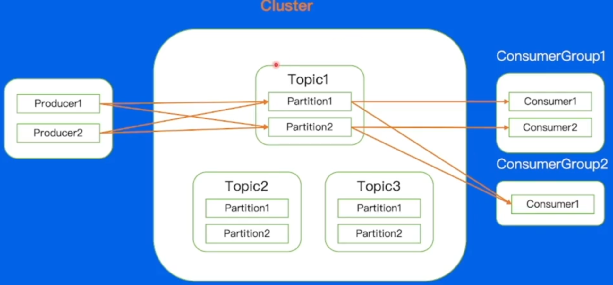
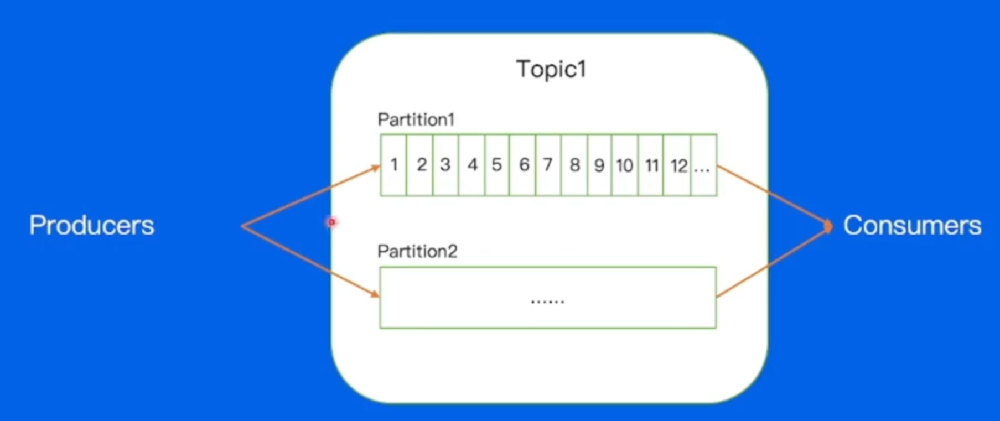
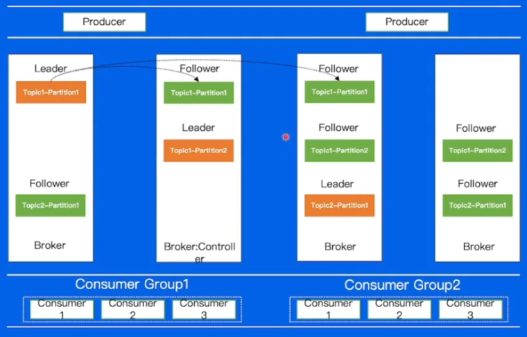
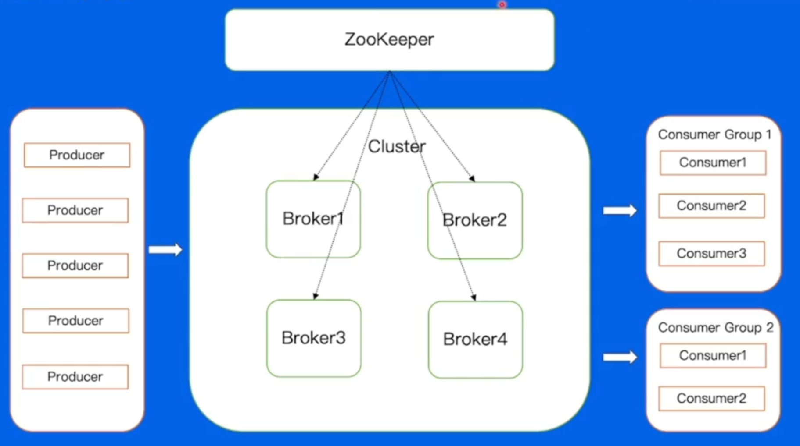
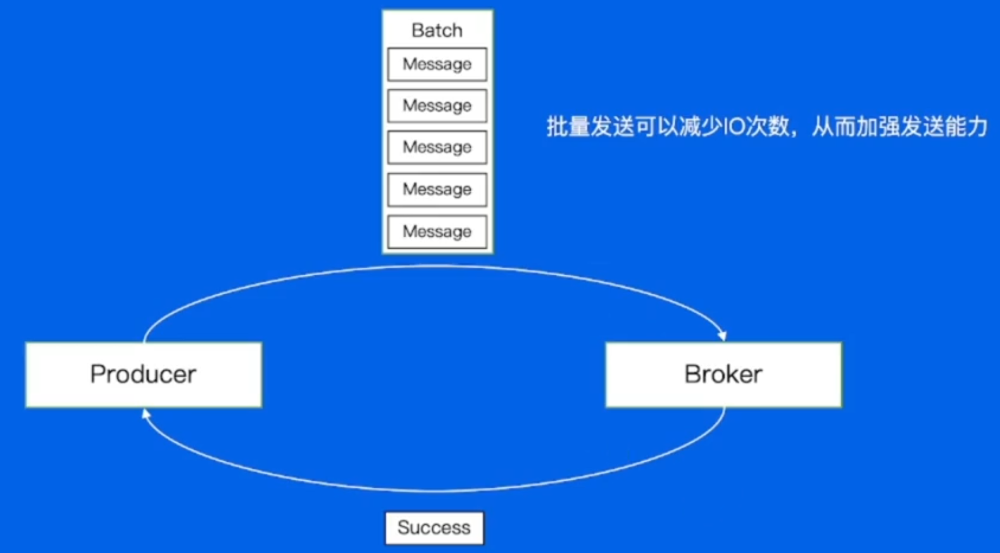
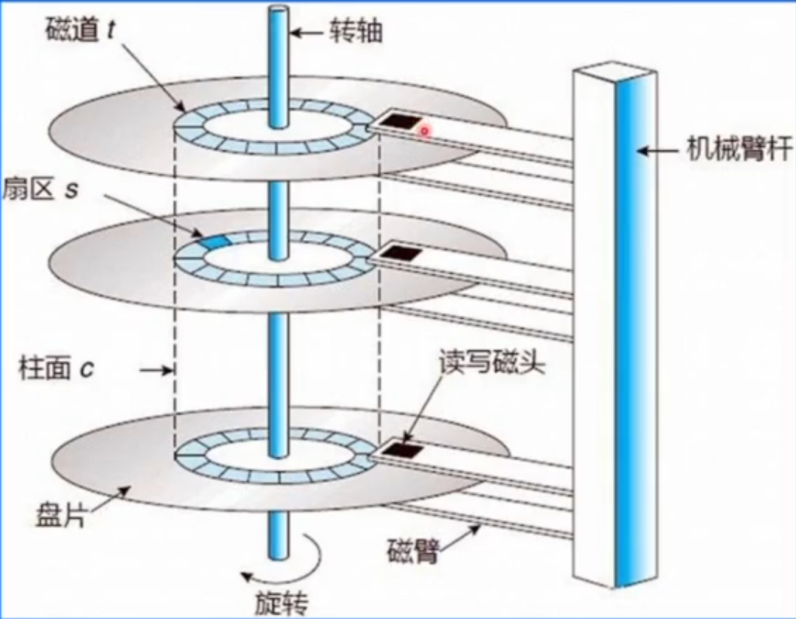
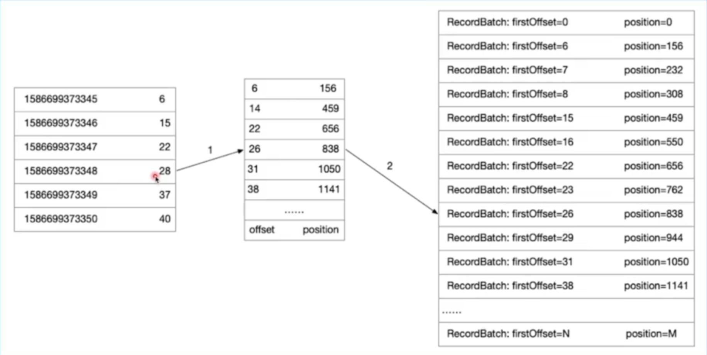
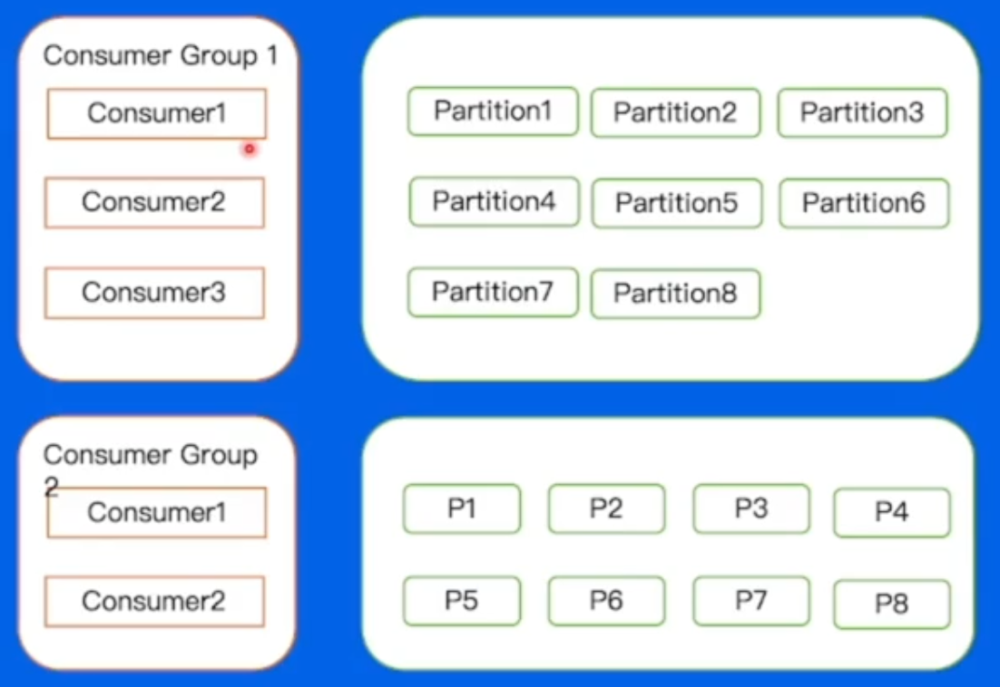

# kafka

## kafka的使用场景

1. 将日志信息存储进下层组件
2. 处理Metrics数据
3. 对用户行为进行操作

## kafka的使用

### 使用流程

1. 创建集群
2. 新增Topic，设置好分区数量
3. 引入SDC，编写生产者逻辑
4. 编写消费者逻辑

### 概念解释

**架构**

1. **Cluster** 物理集群，一个集群中可以放置多个Topic
2. **Topic** kafka中的一个逻辑队列，可简单理解为一个业务场景对应一个Topic
3. **Partition**  分区，每个分区同一时刻只能被一个消费者组使用。同一个Topic不同分区之间消息可以并发处理

**生产消费**

1. **Producter**  生产者，负责将消息业务发送到kafka中 
2. **Consumer**  消费者，负责消费Topic中的消息
   - **ConsumerGroup**  消费者组，不同组之间的消费进度不相互干涉
   - 一个消费者组可以使用多个分区，但是每个分区同时只能被一个消费者组使用

## 底层结构

### 队列结构

#### Offset

分区的内部结构

Offset，是在Paratition里面的小格子
- 存储消息在paratition的相对位置信息，可以理解为唯一ID
- 在partition内部严格递增

详细作用如下：

1. 消息存储层面

   - **定位消息**：在 Kafka 里，消息是以分区（Partition）为单位进行存储的，每个分区中的消息都会被依次编号，这个编号就是 Offset。它就像一个精确的地址，能够唯一标识分区内的每一条消息。通过 Offset，Kafka 可以快速定位到分区中特定的消息，方便进行消息的读写操作。例如，生产者向分区写入消息时，Kafka 会为每条消息分配一个递增的 Offset；消费者在读取消息时，也依据 Offset 来确定要读取的消息位置。

   - **顺序保证**：Offset 的递增特性保证了分区内消息的顺序性。在同一个分区中，消息按照 Offset 从小到大的顺序依次存储，这使得消费者可以按照顺序读取消息，对于一些对消息顺序有严格要求的业务场景（如金融交易记录）非常重要。

2. 消费者消费层面

   - **记录消费进度**：消费者在消费消息时，需要记录自己已经消费到的位置，以便在重启或者发生故障后能够从上次中断的地方继续消费。这个记录的位置就是 Offset。每个消费者组（Consumer Group）会为每个它订阅的分区维护一个 Offset，记录该消费者组在该分区中已经消费的最后一条消息的 Offset。

   - **实现多消费者并行消费**：Kafka 允许一个主题的分区被多个消费者组中的消费者并行消费。通过 Offset，不同的消费者可以独立地维护自己的消费进度，互不干扰。每个消费者可以根据自身的需求和处理能力，从不同的 Offset 位置开始消费消息，从而实现高效的并行消费。

3. 数据管理层面

   - **日志清理策略依据**：Kafka 采用日志（Log）的形式来存储消息，随着时间的推移，日志文件会不断增大。为了控制存储空间的使用，Kafka 会根据一定的策略进行日志清理。Offset 是日志清理策略的重要依据之一。例如，Kafka 可以根据保留时间或者保留的消息数量来清理旧的日志文件，而 Offset 可以帮助确定哪些消息已经超出了保留范围，从而进行清理操作。

   - **数据恢复和备份**：在进行数据恢复或者备份时，Offset 也起到了关键作用。通过记录和恢复 Offset，可以确保数据在恢复或者备份后，消费者能够继续从正确的位置开始消费消息，保证业务的连续性。

#### Replica

1. 实际上在一个partition中，有很多个队列（上面讲解的内容只展示了一个主的队列）
2. 这些队列并不是去并发传递的，而是承担了一个备份容灾的作用，这些队列称为：Replica
3. 主的Replica成为Leader，其他的Replica成为Follower。Follower从Leader中拷贝消息作为副本
4. 以一定的标准判定Follower的合规性，之前的版本按照的是相差消息数量、之后有版本使用的是和最新消息间隔的时间。和Leader差距在范围之内Follower位于ISR区域，当Leader宕机的时候会从ISR中选取

### 数据复制

#### BrokerController

由BrokerController进行计算，对集群当中的所有副本进行一个分配，以下是BrokerController的作用：

1. 集群管理

   - Broker 注册与监控
     - 当一个新的 Broker 启动时，它会向控制器注册自己的信息。控制器会在内部维护一个当前活跃的 Broker 列表，记录每个 Broker 的元数据，如 Broker ID、主机名、端口号等。
     - 控制器持续监控 Broker 的状态，通过 ZooKeeper（在早期依赖 ZooKeeper 的版本中）或者内部的元数据管理机制（如 KRaft 模式）来检测 Broker 的加入和退出。一旦发现有 Broker 故障或停止运行，控制器会立即感知到并进行相应的处理。

   - 集群状态维护
     - 控制器负责维护整个 Kafka 集群的状态信息，包括主题、分区和副本的状态。它跟踪每个分区的领导者副本和追随者副本的分布情况，确保集群的正常运行。
     - 当集群发生变化（如 Broker 加入或退出、主题创建或删除）时，控制器会更新集群状态，并通知相关的 Broker 进行相应的调整。

2. 主题和分区管理

   - 主题创建与删除
     - 当创建一个新的主题时，控制器负责为该主题分配分区，并决定每个分区的副本分布。它会根据集群的当前状态和配置信息，合理地将分区和副本分配到不同的 Broker 上，以实现负载均衡和高可用性。
     - 在删除主题时，控制器会协调各个 Broker 删除该主题的所有分区和副本数据，并更新集群的元数据。

   - 分区重分配
     - 当需要对分区进行重分配（例如为了平衡集群负载或增加副本数量）时，控制器会负责制定重分配计划，并协调各个 Broker 执行该计划。它会确保在重分配过程中数据的一致性和可用性，尽量减少对客户端的影响。

   - 分区领导者选举
     - 对于每个分区，Kafka 会选举一个领导者副本负责处理该分区的读写请求，其他副本作为追随者副本进行数据同步。当分区的领导者副本出现故障时，控制器会触发领导者选举过程，从该分区的追随者副本中选举出一个新的领导者。
     - 控制器会根据副本的状态和同步情况，选择最合适的副本作为新的领导者，以确保分区的读写性能和数据一致性。

3. 副本管理

   - 副本状态监控
     - 控制器会监控每个分区副本的状态，包括副本是否同步、是否存活等。它会定期从 Broker 收集副本的状态信息，并根据这些信息判断副本是否正常工作。
     - 如果发现某个副本出现问题（如数据同步延迟过大或副本不可用），控制器会采取相应的措施，如调整副本的角色或进行副本的重新分配。

   - 副本同步管理
     - 控制器会协调副本之间的数据同步过程，确保追随者副本能够及时从领导者副本复制数据。它会根据副本的状态和网络情况，调整同步的频率和策略，以提高数据同步的效率和可靠性。

4. 与其他组件的交互

   - 与 Broker 的通信
     - 控制器通过内部的通信机制与各个 Broker 进行交互，向 Broker 发送指令（如分区重分配、领导者选举等），并接收 Broker 的状态信息和反馈。
     - 它确保 Broker 能够按照集群的整体规划进行工作，维护集群的一致性和稳定性。

   - 与客户端的交互
     - 虽然控制器本身不直接与客户端进行交互，但它通过维护集群的元数据和状态信息，间接影响客户端的行为。例如，客户端在发送和接收消息时，需要从控制器维护的元数据中获取分区的领导者信息，以确定消息的发送和接收目标。

#### zookpeer

1. 早起的Kafka依赖Zookeeper进行集群的管理。ZooKeeper 具有高可用、分布式、顺序一致性等特性，能够为 Kafka 提供可靠的分布式协调服务，帮助 Kafka 实现集群的管理和元数据的存储。
2. 简单来说就是存储集群元信息，分区和分配的信息

**zookpeer功能如下：**

1. Broker 注册
   - Kafka 中的每个 broker 启动时，都会在 ZooKeeper 中创建一个临时节点（例如 `/brokers/ids/[broker.id]`），并将自己的元数据（如主机名、端口号等）写入该节点。
   - 其他组件（如控制器和消费者）可以通过 ZooKeeper 发现这些 broker 节点，从而知道集群中有哪些可用的 broker。
2. 主题管理
   - 主题的创建、删除和配置信息都存储在 ZooKeeper 中。例如，当创建一个新的 Kafka 主题时，会在 ZooKeeper 中创建相应的节点（如 `/brokers/topics/[topic.name]`），并记录主题的分区数量、副本因子等信息。
   - Kafka 会根据 ZooKeeper 中存储的主题信息进行分区分配和副本同步。
3. 分区和副本管理
   - ZooKeeper 存储了每个主题的分区信息，包括分区的数量、每个分区的副本分布情况等。
   - Kafka 利用这些信息进行分区的领导者选举。当分区的领导者发生故障时，Kafka 会通过 ZooKeeper 重新选举新的领导者，确保分区的正常读写操作。
4. 控制器选举
   - Kafka 集群中有一个特殊的 broker 被称为控制器（Controller），它负责管理整个集群的状态，如分区的领导者选举、副本的分配等。
   - 控制器的选举过程依赖于 ZooKeeper。多个 broker 会竞争在 ZooKeeper 中创建一个特定的临时节点（如 `/controller`），第一个成功创建该节点的 broker 将成为控制器。
5. 消费者组管理
   - 消费者组的元数据（如消费者组的 ID、消费者的成员信息等）存储在 ZooKeeper 中。
   - 当消费者加入或离开消费者组时，Kafka 会通过 ZooKeeper 协调消费者组的重新平衡，确保每个分区都能被正确地分配给消费者组中的某个消费者。

## 消息流动

对于一条消息而言，最基础的结构是这样的

1. Producer生产消息到Broker
2. Broker发送消息到Consumer，这一步称为消费

### Producer消息发送

如果发送一条消息，等待成功响应之后再发下一条消息可以吗？

很明显是无法支持高并发场景的

#### 改良1

最先想到的运行方式大概如下：

这个方式是将消息进行打包，整组传输，而不是发一个等一个响应，这样可以提高速度。

#### 改良2

上述方式存在一个问题，就是单条消息如果过大的话怎么做？

采用的方法是将Batch进行压缩、之后再传输，常用的压缩算法如下：

1. Snappy
2. LZ4
3. ZSTD（推荐）

### Broker数据存储

#### 数据结构

如何将打包的Batch存储到本地磁盘？

1. 消息最终以日志的形式写入磁盘上
2. 对于最终存储的一个LogSegment来说，存储的文件分为四个
   - .log 日志文件
   - .index 偏移量索引文件（offest和真实数据之间存在偏移量，这个文件记录了它的索引）
   - .timeindex 时间戳索引文件 第一条消息的时间戳
   - 其他文件 

#### 磁盘结构

1. 磁盘移动磁头找到对应的磁道，磁盘移动，找到对应是扇区，最后写入。
2. 寻道的成本高，因此使用顺序写可以减少寻道所带来的时间成本

因此，kafka使用顺序存储，**末尾追加**的方式进行写入

### Broker数据读取交给Consumer

Consumer通过发送FetchRequest请求消息数据，Broker会将指定Offset出的消息，按照时间窗口和消息大小窗口发送给Consumer

这时候就涉及到Broker如何索引文件了

#### 偏移量索引文件

比如需要寻找offset=28的一个文件

1. 使用二分法进行查找，找到小于a的最大offset的文件

2. 在其中进行查找，目前找到的结果就是26，对应的位置是838，之后就从838开始往下读，督导

   

#### 时间戳索引文件

对于时间戳索引的某个文件，大致查询流程如下：

1. 找小于目标时间戳的最大索引位置
2. 其余流程和偏移量一样，相当于是加了一层时间的封装
3. 为什么时间戳会和偏移量一样呢？ 因为读写顺序是顺序插入的（上面提到过）

#### Broker数据拷贝

除了上述的流程之外，再提及一下关于Broker对于数据拷贝的优化

**传统拷贝的流程：**

1. **磁盘 → 内核缓冲区**：数据从磁盘读取到内核空间的 **PageCache**（由操作系统管理）。
2. **内核缓冲区 → 用户缓冲区**：数据从内核空间拷贝到用户空间（例如 Kafka 进程的缓冲区）。
3. **用户缓冲区 → 内核 Socket 缓冲区**：数据从用户空间再次拷贝到内核的网络协议栈缓冲区（NIC Buffer）。
4. **Socket 缓冲区 → 网卡**：数据最终通过 DMA（直接内存访问）发送到网卡。

**问题**：步骤 2 和 3 的两次拷贝（内核态↔用户态）消耗 CPU 资源，且增加了延迟。

对于这种拷贝方式进行了以下“零拷贝”的优化：**ReadBuffer直接连NICBuffer**（Kafka 利用操作系统提供的零拷贝机制（如 Linux 的 `sendfile` 或 `mmap`），跳过用户空间的拷贝，直接将数据从磁盘文件传输到网卡）

 步骤如下：

1. **磁盘 → PageCache**
   - 数据首先从磁盘读取到内核的 **PageCache**（由操作系统缓存，后续读取可复用）。
   - 如果数据已在 PageCache 中（Kafka 的顺序读写预读机制优化了这一点），则直接跳过磁盘 I/O。
2. **PageCache → NIC Buffer（零拷贝）**
   - Kafka 调用 `sendfile()` 系统调用，通知操作系统：
     - **源**：PageCache 中的文件描述符（`.log` 文件）。
     - **目标**：Socket 的文件描述符（对应消费者的网络连接）。
   - 操作系统通过 **DMA（直接内存访问）**，将数据从 PageCache **直接拷贝到网卡缓冲区（NIC Buffer）**，全程无需经过用户空间。
3. **NIC Buffer → 网络**
   - 网卡通过 DMA 将数据发送到网络，完成传输。

**关键点**

- **零拷贝**：数据在传输过程中**无需经过用户空间**（避免了 `read()` 和 `write()` 的系统调用）。
- **CPU 不参与数据拷贝**：仅由 DMA 控制器和操作系统协作完成，释放 CPU 算力。
- **上下文切换减少**：传统方式需要 4 次上下文切换（用户态↔内核态），零拷贝仅需 2 次。

### Consumer消息接收

首先需要考虑的就是Partition在消息接收如何将消息发送给每个消费者组，每个消费者？

1. 对于消费者组而言，由于每个消费者组都是相互独立的，因此需要拉取Topic中的**所有partition**

2. 对于消费者而言，当一个消费者组拉取了所有的Partition之后，如何分配给消费者一般用手动分配和自动分配两个策略

#### 手动分配

手动分配中，哪一个consumer消费哪一个Partition由业务来决定（写在代码里面）

**工作流程**

1. Consumer 启动时，直接绑定到指定的 Partition。
2. **无 Group 协调**：手动分配的 Consumer **不加入 Consumer Group**，因此不受 Group Coordinator 管理。
3. **独立消费**：每个 Consumer 独立消费分配给它的 Partition，即使多个 Consumer 订阅同一 Topic，也不会触发 Rebalance。

**特点**

- 由开发者**显式指定** Consumer 消费的 Partition，**不依赖 Kafka 的协调机制**。
- 适用于需要**精确控制**消费逻辑的场景（例如按业务规则分配 Partition）。

**缺点**

1. **容灾：**无法自动容灾，如果传输到P7的时候挂掉了，那后两个就无法正常传给消费者
2. **扩容：** 如果现在某台机器负载不够（新加消费者的时候要在新的机器上），需要加机器的时候需要手动关闭之前的机器（分配关系是在代码逻辑中写死的）

#### 自动分配

**工作流程**

1. **Consumer 加入 Group**：
   - Consumer 启动时向 Group Coordinator 注册，触发 Rebalance。
2. **Rebalance 过程**：
   - Group Coordinator 根据 Partition 分配策略（如 Range、Round-Robin、Sticky）重新分配 Partition。
   - 所有 Consumer 同步新的分配方案。
3. **心跳维持**：
   - Consumer 定期发送心跳，若超时则被视为宕机，触发新一轮 Rebalance。

**Partition 分配策略**

Kafka 提供多种内置策略（通过 `partition.assignment.strategy` 配置）：

- **Range（默认）**：
  按 Partition 范围分配，可能导致负载不均（例如 3 Partition 分给 2 Consumer 时，一个 Consumer 分配 2 个 Partition）。
- **Round-Robin**：
  轮询分配，尽量均衡分布，但可能在 Consumer 增减时引发大量 Partition 移动。
- **Sticky**：
  尽量保留原有分配，减少 Rebalance 时的 Partition 迁移（减少开销）。

**特点**

- 由 Kafka 的 **Group Coordinator** 动态分配 Partition 给 Consumer Group 中的成员。
- 支持**负载均衡**和**故障恢复**（通过 Rebalance 机制）。
