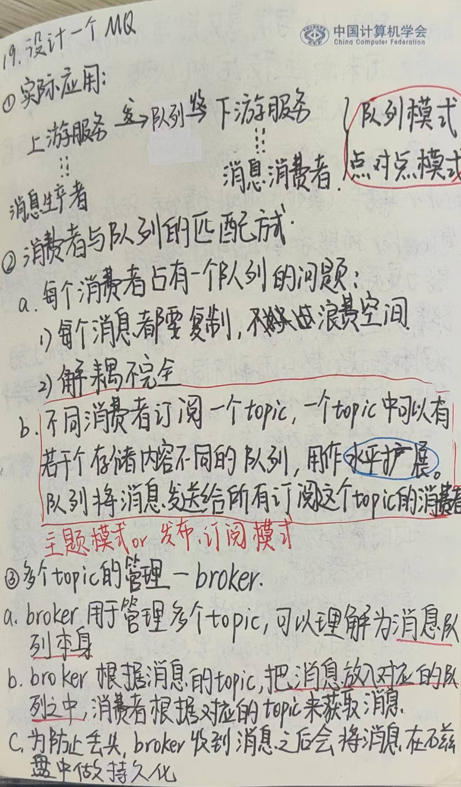
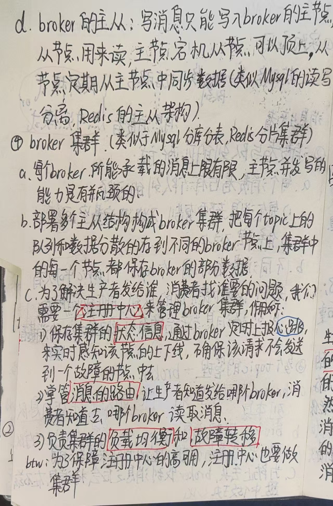
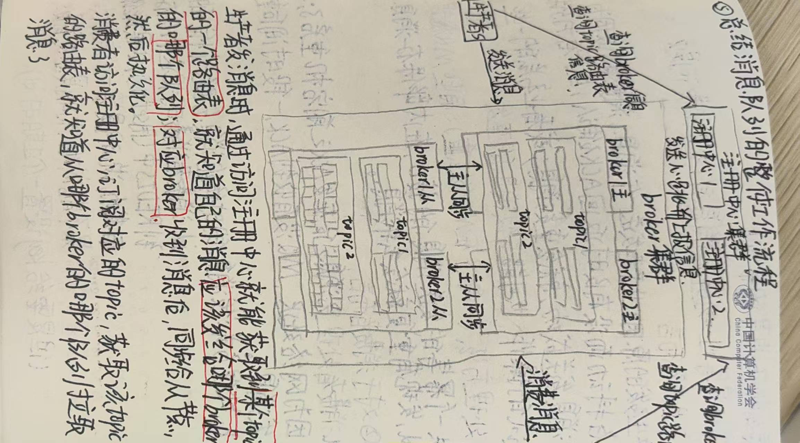
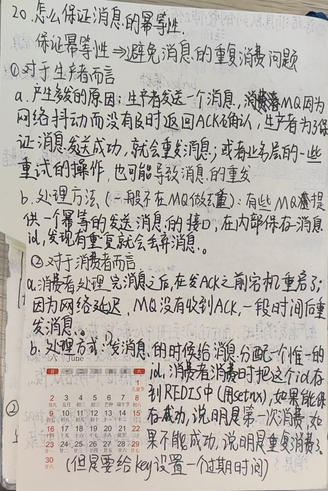
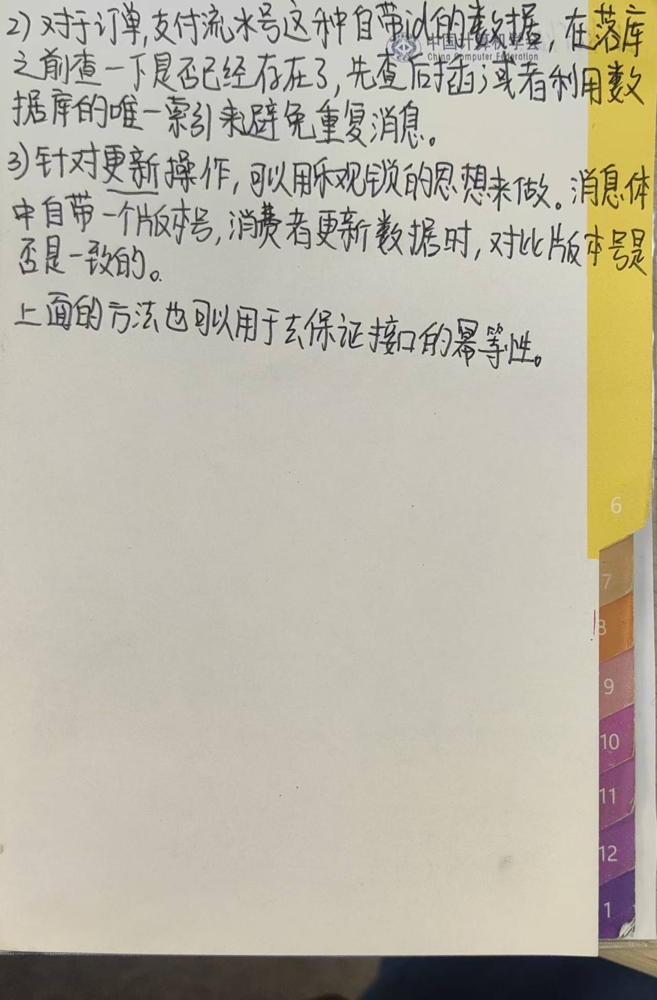

#  消息队列

当某人进入抖音直播间购买一件商品的时候，可能会发生如下的案例

## 案例

### 案例(1)——系统崩溃

如果此时数据库模块发生宕机，这个事件会整体卡死，应该如何处理？

使用消息队列解耦，先顺利进行流程，之后再通过消息队列将数据存入存储服务

### 案例(2)——服务能力有限

如果一个服务只能处理100个并发量，面对超过的容量的应该如何处理？

### 案例(3)——链路耗时长尾

按照这个流程而言，每个用户抢到商品的需要经过30s左右，大部分时间消耗在通知商家的环节，应该如何优化

使用消息队列，将耗时长的任务单独间隔开，实现用户响应的敏捷性

### 案例(4)——日志存储

如果本地日志丢失，应该如何追回或者恢复

先将日志存储在消息队列里面，之后存储在一些搜索引擎类似的组件中

## 消息队列是什么

总结一下以上的案例，发现消息队列使用的场景有如下的特点

1. 将可能会报错的步骤单独隔离开
2. 将耗时较长的步骤单独隔离开
3. 在大量需求打入小型服务之前起到排队缓冲的作用
4. 将数据进行缓存

### 消息队列定义

消息队列(MQ)，指保存消息的一个容器，本质个队列。但这个队列呢，需要支持高吞吐，高并发，并且高可用

### 消息队列作用

**基础架构**

**消息队列作用**

1. **解耦：** 系统服务和矩阵管理服务只需要发布订阅消息，每个节点去订阅消息即可，这样三个服务之间就完全解耦了

2. **异步：** 使用消息队列还有一个特别明显的好处，那就是可以将同步的逻辑异步化
3. **削峰:** 在未使用消息队列的系统中，系统面对突发大流量会导致系统崩溃。在使用消息队列之后，可以将大量消息积压在消息队列中，下游服务慢慢的从消息队列中消费即可

## 消息队列的发展

# 理解消息队列

## 静态角度

## 动态角度

在一条消息的发送过程中，下面这些部分起的作用可以作如下类比

- **生产者 (Producer)**： **要寄快递的人**。
- **队列 (Queue)**： **快递公司的中转仓库**。
- **消费者 (Consumer)**： **收快递的人**。
- **消息 (Message)**： 要寄的**包裹**。
- **ACK (Acknowledgment)**： 收件人**签收包裹后给快递公司的确认回执**。

#### 第一步：生产者发送消息

1. **创建连接**： 生产者（应用程序）先与消息队列服务器（如RabbitMQ, Kafka）建立一个网络连接。
2. **创建通道**： 在连接上建立一个**通道**（Channel）。通道是一个轻量级的连接，大部分操作都在通道上进行，避免了频繁创建和销毁TCP连接的开销。
3. **声明队列**： 生产者确保消息要发送到的队列存在。如果队列不存在，它会创建这个队列。（就像你确认快递公司有到你目的地的线路）。
4. **发送消息**： 生产者将消息（包含业务数据和一些元数据）发布到指定的交换器（Exchange），交换器根据预定的规则（路由键）将消息投递到一个或多个队列中。为了简化，我们可以理解为**直接发送到队列**。
5. **（可选）确认模式**： 对于可靠性要求高的场景，生产者可以开启**确认模式**。这时，它会等待队列返回一个“确认”（Publisher Confirm），表示消息已经成功被队列接收并持久化（如果设置了持久化）。如果没有收到确认，生产者可能会重发消息。

> **此步小结**： 生产者的工作就是把消息安全地送到“中转仓库”（队列）里。

------

#### 第二步：队列存储和传递消息

1. **接收消息**： 队列接收到生产者发来的消息。
2. **存储消息**： 将消息按照顺序存储在内存或磁盘（如果消息被标记为持久化）中。
3. **等待消费者**： 队列处于等待状态，如果有消费者连接到它，并且处于空闲状态，队列会立即将消息推送给消费者（如RabbitMQ的Push模型），或者等待消费者来拉取（如Kafka的Pull模型）。
4. **标记消息状态**： 一旦消息被发送给消费者，队列会**暂时标记该消息为“未确认”状态**。这条消息不会被立即删除，而是对其它消费者不可见（假设没有做特殊配置）。

> **此步小结**： 队列的核心职责是可靠地存储消息，并做好将消息分发给消费者的准备。

------

#### 第三步：消费者消费与ACK

这是ACK机制最关键的环节。

1. **建立连接和通道**： 消费者同样需要建立与消息队列的连接和通道。
2. **订阅队列**： 消费者向队列表明自己要消费哪个队列的消息。
3. **获取消息**： 队列将消息推送给消费者（或消费者主动拉取）。
4. **处理业务逻辑**： 消费者收到消息后，开始执行自己的业务代码（比如：扣减库存、发送邮件、处理订单等）。
5. **发送ACK**： **这是决定消息命运的时刻！**
   - **情况A：正常处理完毕 (ACK)**
     - 消费者成功处理完业务逻辑后，会**主动向消息队列发送一个ACK（确认信号）**。
     - 队列收到ACK后，才认为这条消息已经被**成功消费**，然后将其从队列中**永久删除**。
     - **比喻**： 收件人完好地收到了包裹，签了字，快递公司拿到回执后，就知道这个包裹的任务完成了，可以销毁记录了。
   - **情况B：处理失败 (NACK / Reject)**
     - 如果消费者在处理过程中出现异常（比如代码bug、数据库连接失败），它可以选择：
       - **NACK (Negative Acknowledgment)**： 明确告诉队列“处理失败”。
       - 或者直接**不发送ACK**（因为网络断开或程序崩溃）。
     - 队列在检测到处理失败（NACK）或等待ACK超时（超时时间可配置）后，会对这条消息进行处理。处理方式通常有两种：
       - **重新入队**： 将消息重新放回队列，准备再次投递给**另一个**（或同一个）消费者。这确保了消息至少被消费一次。
       - **进入死信队列**： 如果消息重复失败太多次，为了避免“毒药消息”堵塞队列，可以将其转移到另一个专门存放失败消息的队列（死信队列）中，供后续人工排查。

> **此步小结**： 消费者的核心是处理消息，并通过ACK机制告知队列处理结果。**队列只有在收到消费者的ACK后，才会删除消息**，这是保证消息不丢失的关键。

------

### 核心要点总结

| 角色       | 核心操作                   | 关于ACK的职责                                                |
| :--------- | :------------------------- | :----------------------------------------------------------- |
| **生产者** | 创建并发送消息到队列。     | 可以要求队列返回“已接收”的确认，确保消息不丢。               |
| **队列**   | 存储和路由消息。           | **1. 等待消费者的ACK。** **2. 根据ACK结果决定删除消息还是重新投递。** |
| **消费者** | 从队列获取消息并处理业务。 | **在处理成功后，必须主动发送ACK给队列。** 这是消费者的责任。 |

### 为什么ACK如此重要？

- **可靠性保证**： 它确保了消息至少被消费一次（At-Least-Once Delivery）。即使消费者在处理过程中崩溃，消息也不会丢失，而是会重新投递。
- **流量控制**： 队列可以通过不发送新消息给已满的消费者（在收到ACK前只发送一条消息）来实现简单的负载均衡，防止消费者被压垮。

# 如何保证幂等性

## 为什么MQ使用消息ID做了丢弃重复消息的操作之后，消费者还是会重复消费消息呢？

**MQ服务端做的“去重”和“消费者重复消费”发生在流程的两个不同阶段，解决的问题也不同。** 即使MQ服务端保证了消息本身不重复，也无法单方面阻止消费者侧的重复消费。简单直接的回答是：**MQ服务端做的“去重”和“消费者重复消费”发生在流程的两个不同阶段，解决的问题也不同。** 即使MQ服务端保证了消息本身不重复，也无法单方面阻止消费者侧的重复消费。下面我们分层来剖析这个问题。

---

### 第一层：MQ服务端的消息去重（生产者侧去重）

这个机制的目标是：**确保同一条消息不会被MQ服务器存储两次。**

*   **何时发生？** 在**生产者发送消息**到MQ服务器的过程中。
*   **为何需要？** 网络是不可靠的。生产者发送消息后，可能没有收到MQ的确认响应（比如网络闪断、MQ服务器短暂崩溃）。此时生产者无法判断是消息没发送到，还是只是确认响应丢失了。为了保险起见，生产者通常会选择**重试**，再次发送这条消息。
*   **如何解决？** MQ服务端（如RabbitMQ, RocketMQ）可以启用**消息去重**机制。通常基于生产者传入的 **`Message ID`** 或一个业务主键，在一个短暂的时间窗口内进行判断。
    *   **流程比喻**： 这就像快递公司的**仓库入库系统**。你（生产者）第一次寄出一个包裹（消息），仓库（MQ）扫描单号（Message ID）入库成功。如果你因为没收到确认，又寄了一个一模一样单号的包裹，仓库系统会识别出这个单号已经存在，会**拒绝第二次入库**，从而保证仓库里不会有两个完全相同的包裹。

**到这一步，MQ服务器内部存储的消息确实是唯一的了。**

---

### 第二层：消费者侧的重复消费（消费过程去重）

这个问题的根源是：**消费者已经从MQ拉取了消息，并且处理了业务逻辑，但在向MQ返回ACK（确认消费成功）时失败了。**

*   **何时发生？** 在**消费者处理消息并向MQ返回ACK**的过程中。
*   **为何会发生？** 这是一个非常经典的分布式系统问题场景：
    1.  **场景一（业务处理成功后ACK失败）**：
        *   消费者拉取到消息`Msg{A}`。
        *   消费者成功处理了业务（例如，扣减了库存）。
        *   就在要发送ACK给MQ的一瞬间，消费者的网络断了，或者消费者程序突然崩溃了。
        *   MQ服务器**没有收到ACK**，它会认为消费者处理失败了。
        *   MQ服务器会根据规则（比如等待超时后）将消息`Msg{A}`**重新投递**给另一个消费者（或者重启后的同一个消费者）。
        *   结果：业务逻辑被执行了两次，造成重复消费。

    2.  **场景二（业务处理时间过长）**：
        *   消费者拉取消息`Msg{A}`并开始处理。
        *   处理时间超过了MQ配置的ACK超时时间。
        *   MQ服务器等不及了，认为消费者“卡死了”，于是将消息`Msg{A}`重新投递给其他消费者。
        *   结果：可能有两个消费者同时在处理同一条消息。

*   **核心矛盾**： **对于MQ来说，它判断消息是否被成功消费的唯一标准就是是否收到ACK。** 它无法知晓消费者一侧的业务逻辑到底执行到了哪一步。

---

### 总结与类比

让我们用一个更完整的比喻来串联整个过程：

1.  **MQ服务端去重（仓库入库去重）**：
    *   你（生产者）给仓库（MQ）发了一个单号为`ID-123`的包裹。仓库成功入库。
    *   你不放心，又发了一个单号同样是`ID-123`的包裹。仓库系统识别出重复，把第二个包裹扔掉了。**现在仓库里只有一个`ID-123`的包裹。**

2.  **消费者重复消费（派送员重复派送）**：
    *   派送员小王（消费者1）从仓库取走了包裹`ID-123`，并成功送给了客户（执行业务逻辑）。
    *   客户签收了（业务成功），但小王在回仓库的路上，对讲机坏了（网络中断），没能向仓库系统汇报“派送成功”（ACK丢失）。
    *   仓库系统一直没收到小王的回信，以为派送失败了。于是它又把包裹`ID-123`的任务派给了派送员小李（消费者2）。
    *   小李拿着（在仓库系统里看是）同一个包裹`ID-123`，再次送给客户。**客户收到了两次相同的包裹（重复消费）。**

### 结论：如何解决重复消费？

既然MQ服务端无法完全避免重复投递，那么**解决重复消费的责任就落在了消费者身上**。消费者必须实现**幂等性**。

*   **幂等性**： 一个操作执行一次与执行多次，产生的结果是相同的。
*   **如何实现幂等性**？
    *   **利用数据库唯一键**： 比如在扣减库存时，在流水表里记录消息ID。利用数据库的唯一约束，当插入重复的消息ID时，会失败，从而避免重复处理。
    *   **使用Redis等缓存的原子操作**： 在处理消息前，执行 `SETNX MessageID 1` 命令。如果设置成功，说明是第一次处理；如果失败，说明已经处理过了。
    *   **版本号机制**： 更新数据时，带上数据的版本号。只有版本号匹配时才更新，同时版本号+1。

**所以，完整的可靠性保障是：**
**MQ服务端的去重机制（At-Least-Once投递） + 消费者业务的幂等性设计 = 消息的Exactly-Once语义（最终效果上的只消费一次）。**

## 乐观锁与悲观锁思想

用一个非常经典的比喻——“**抢票**”来解释乐观锁和悲观锁的核心思想。

---

### 核心思想一句话概括

*   **悲观锁**：认为“**肯定会有冲突**”，所以操作数据前**先加锁**，防止别人修改。
*   **乐观锁**：认为“**冲突很少发生**”，所以操作数据时**不加锁**，只在提交更新时检查一下这期间有没有别人改过。

---

### 比喻：两个人（A和B）同时抢最后一张票

#### 场景一：悲观锁的做法（像上厕所锁门）

1.  **想法（悲观）**： “肯定还有别人要来抢这张票，我得先把票锁起来，谁也别想动。”
2.  **步骤**：
    *   A 来到售票处，**二话不说，直接把放票的抽屉锁上**（获取锁）。
    *   A 不紧不慢地查看票数（还剩1张），然后完成付款、出票等一系列操作。
    *   ️ 这时 B 也来了，想买票，但发现抽屉被锁了，**他只能等着（阻塞）**，或者去干点别的事。
    *   A 操作完成，把抽屉的锁打开（释放锁）。
    *   B 此时才能去操作抽屉，但发现票已经没了。
3.  **特点**：
    *   **优点**： 保证绝对的安全，A在操作时，B绝对无法干扰。
    *   **缺点**： **效率低**。如果A的操作很慢，B就要等很久。而且加锁、释放锁本身也有开销。

> **在数据库中**：这就像是使用 `SELECT ... FOR UPDATE` 语句，先锁定这条记录。

---

#### 场景二：乐观锁的做法（像用便签记录版本）

1.  **想法（乐观）**： “大概率不会有人跟我同时抢这张票吧？我先看下票数，付钱的时候再看看票数变没变就行。”
2.  **步骤**：
    *   A 和 B **同时**来到售票处，他们都看到电子屏幕上显示余票为 `1`，版本号是 `v1`。
    *   A 和 B **都各自开始**自己的付款流程，互不干扰。
    *   A 的手速更快一点，先完成了付款。系统在扣票前会检查：“当前票的版本号还是 `v1` 吗？” 检查通过，扣减票数，并将版本号更新为 `v2`。
    *   稍后，B 也完成了付款。系统同样进行检查：“当前票的版本号还是 `v1` 吗？” **结果发现版本号已经变成了 `v2`**，说明数据已经被别人修改过了！
    *   系统告诉 B：“抢票失败，请重试。” B 的操作失败，他需要重新读取最新的票数（现在是0）和版本号（`v2`），然后决定下一步（不买了或做其他处理）。
3.  **特点**：
    *   **优点**： **效率高**。在大部分没有冲突的情况下，A和B可以并发操作，不需要等待。
    *   **缺点**： 在冲突真的发生时，B的操作会失败，需要有重试机制。如果冲突非常频繁，不断重试反而会降低效率。

> **在数据库中**：这通常通过一个 `version` 字段实现。更新时语句类似：`UPDATE table SET stock = stock - 1, version = version + 1 WHERE id = 123 AND version = old_version`。

---

### 对比总结

| 特性         | 悲观锁                                           | 乐观锁                                       |
| :----------- | :----------------------------------------------- | :------------------------------------------- |
| **核心思想** | **“先锁再干”**                                   | **“干了再验”**                               |
| **适用场景** | **写多读少**，冲突频繁的场景（如银行转账）       | **读多写少**，冲突较少的场景（如点赞、评论） |
| **实现方式** | 数据库的行锁、表锁等（如 `FOR UPDATE`）          | 版本号、时间戳、状态标记等                   |
| **性能**     | 并发量低时性能好；并发量高时，锁竞争导致性能下降 | 并发量高时性能好；冲突频繁时，重试开销大     |

简单来说：

*   你想**万无一失**，不怕等一会儿，就用**悲观锁**。
*   你想**追求效率**，并且相信冲突不常发生，就用**乐观锁**。