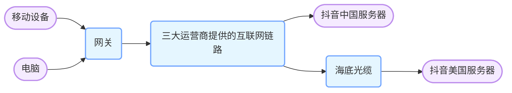

# 网络交互

## 写在前面

学习这门课程，我们需要掌握一些前置知识

1. 掌握Linux基础操作，了解 Wireshark，了解Sockst
2. 了解Dpvs，了解负载均衡是什么

学习目标：将我们简历上的 “**了解**TCP/IP，计算机网络” 改成 “**熟悉**TCP/IP，计算机网络”

## 当刷一条抖音视频时，有哪些协议参与了交互

1. 直接想到的：http协议参与了数据的传输、包括视频流的播放以及视频的下载
2. 还有：DNS协议参与了域名的解析

网络物理结构如下：

这个网络的连接流程计网的最开始讲的很清楚，然而在这样的物理构建中，解释一下可能存在的理解偏差

1. 在同网段并非是直连的，大多数是通过三层交换机进行连接的
2. 并不是每个设备都是严格按照物理结构连接的，SDN的出现使得虚拟网络可以灵活的创建、配置和管理，使得多个用户或者应用可以共享同一物理设备并且保证各自网络环境的隔离
3. 网络路由不一定是对称的，不是哪条路发送那条路就一定会接收
   - 由于网络中有备份链路，当某条路出现故障的时候,可能会启用备用链路
   - 由于设备可能加入或者退出网络，会导致网络拓扑结构实际上是实时动态变化的
   - 路由配置根据需求不同，可能会被管理员根据不同策略配置
   - 负载均衡可能会根据实时情况选择不同的链路来处理网络流量
   - AS（自制系统）之间可能会有自己独立的网络传输选择策略和机制

