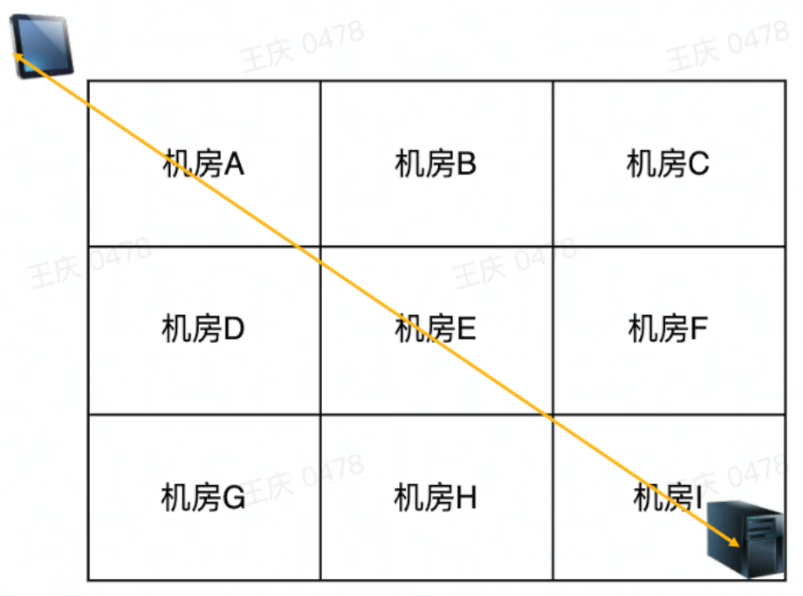
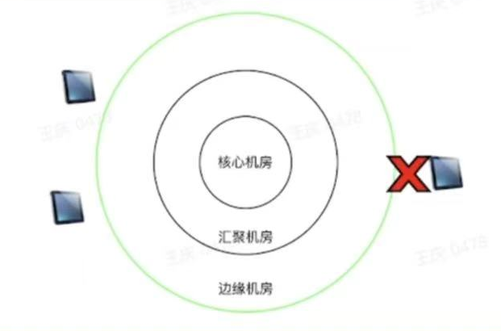
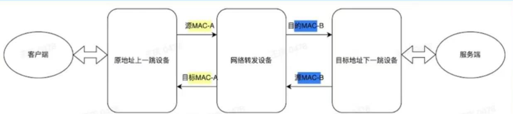

# 网络提质

## 网络提速

### 协议优化（1）——使用http2.0

1. 首先是实现**多路复用**，可以并行的获取资源
   - 在http2.0协议里面看上去是并行传输的（看上去是多路复用）
   - 实际上在TCP连接通道里面是串行传输的
   - 当TCP发生丢包时，发生“队头阻塞”，这个问题导致一直重传前面的包，无法传输后面的包

### 协议优化（2）——使用QUIC(Quick UDP Internet Connections)/http3.0

使用这个可以从本质上解决TCP丢包因其的 队头阻塞 问题

1. 使用UDP协议实现
   - 其一是因为解决这个问题需要修改TCP协议
   - 其二是因为UDP更适配
2. 使用用户态(Userspacd)，而不是内核态(Kernel)
   - 因为内核态推广起来比较复杂
3. 0 RTT(Round-Trip Time)
   - QUIC协议支持https，也就是说支持SSL握手的
   - QUIC协议除了刚开始进行SSL握手，之后的传输可以实现0 RTT
4. QUIC协议具有 弱网传输 的优势，在弱网环境下解决了队头阻塞的问题

### SSL握手过程（补充）

#### **(1) Client Hello**

客户端向服务器发起连接，发送以下信息：

- **支持的 TLS 版本**（如 TLS 1.2/1.3）。
- **客户端随机数（Client Random）**：用于后续密钥生成。
- **支持的加密套件**（如 `ECDHE-RSA-AES256-GCM-SHA384`）。
- **SNI（Server Name Indication）**：指定访问的域名（用于虚拟主机）。

#### **(2) Server Hello**

服务器响应客户端，返回：

- **选定的 TLS 版本和加密套件**。
- **服务器随机数（Server Random）**：用于密钥生成。
- **服务器证书**（包含公钥和域名信息）。
- （可选）**请求客户端证书**（双向认证场景）。

#### **(3) 证书验证**

客户端验证服务器证书：

1. **证书链校验**：检查证书是否由受信任的 CA 签发（如 DigiCert、Let's Encrypt）。
2. **域名匹配**：确认证书中的域名与访问的域名一致。
3. **有效期检查**：确保证书未过期。
4. **吊销状态检查**：通过 OCSP 或 CRL 验证证书是否被撤销。

#### **(4) 密钥交换（非对称加密）**

客户端生成 **预主密钥（Pre-Master Secret）**，并用服务器证书中的 **公钥加密**，发送给服务器：

- **RSA 密钥交换**（传统方式）：
  - 客户端生成 `Pre-Master Secret`，直接用服务器公钥加密。
  - 服务器用私钥解密，获取 `Pre-Master Secret`。
- **ECDHE 密钥交换**（前向保密）：
  - 服务器发送 `ECDHE 参数`（椭圆曲线公钥+签名）。
  - 客户端和服务器通过 ECDHE 算法协商出 `Pre-Master Secret`。

#### **(5) 生成会话密钥**

客户端和服务器通过以下三个随机数生成 **主密钥（Master Secret）**：

1. `Client Random`
2. `Server Random`
3. `Pre-Master Secret`
   然后派生出 **会话密钥（Session Key）**，用于后续对称加密（如 AES-GCM）。

#### **(6) 握手完成**

- 客户端发送 **Finished** 消息（加密），证明密钥正确。
- 服务器发送 **Finished** 消息（加密），确认握手完成。
- 此后所有通信使用 **对称加密**（如 AES）传输数据。

### 数据中心分布

1. 数据中心本质上是服务器集中的地方分为**核心机房**、**POP接入**、**边缘机房**
2. **核心机房：** 存放数据库等核心内容
3. **POP（Point of Presence）接入：**  是网络服务提供商（ISP、CDN、云厂商）在各地的物理节点，用户通过最近的 POP 接入骨干网，减少延迟（RTT）并提升访问速度。
4. **边缘机房：** 基本针对上每个省份的每个运营商都有对应的边缘机房

### 路径优化（1）——同运营商接入

1. 比如移动的设备先接入移动的机房，原因是三大运营商之间的跨运营商接入比较差，容易丢包
2. 通过解析实现的，域名的智能解析，发现你的ip是移动运营商的，就优先接入移动的机房

### 路径优化（2）——静态资源使用CDN（Content Delivery Network）优化

1. 静态资源指的是所有人看到都一样的资源（不会随着API或者IP的变化而变化），比如抖音博主的视频封面和视频内容。
2. **CDN（Content Delivery Network）** 是一种分布式网络架构，通过将内容缓存到全球各地的边缘节点（POP），使用户从最近的服务器获取数据，显著降低延迟（RTT）、提升访问速度，并减轻源站负载。
3. 对于静态资源，用户查询的时候首先是查询边缘机房缓存中是否存在这些资源的缓存，如果存在就直接获取，如果不存在去汇聚机房进行查询；汇聚机房同理

### 路径优化（3）——动态资源使用DSA优化

1. 对于评论（可能被删除、几小时前这些东西不一样）、商品等会动态变化的资源，缓存往往时效性不足，因此只能访问同一机房，这就需要进行路径的优化
2. DSA 路径优化主要涉及 **签名生成** 和 **验证过程** 的性能提升，尤其在需要高频签名/验证的场景（如区块链、物联网设备、HTTPS 握手）。
3. 在应用场景中，简单来讲就是每个机房之间进行传输验证，测试传输所需时间并且记录在一张表中，根据这张表判断机房之间的路径远近，最终选择最近的路径。

## 网络稳定

### 容灾概念

容灾处理故障的流程

1. 故障发生
2. 故障感知
3. 自动切换
4. 服务恢复

### 容灾案例（1）——外网容灾

1. 为了确保传输的迅速，一般机房之间使用专线相连。就像成都和重庆的机房使用专线可以直接相连，不需要经过互联网（互联网可能会先转到上海再转到重庆），大大节约了效率
2. 但是当专线出现问题的时候，需要考虑使用外网进行数据的传输，以实现容灾的处理

### 容灾案例（2）——调度容灾

1. 正常情况下，服务中心会把 bytedance.com 这个域名解析到不同的机房以实现负载均衡。
2. 当机房A出现故障的时候，需要自动的将A剔除掉，A的这些流量转嫁到其他机房，这个自动化系统被称为GTM
   - 首先，判定哪些机房可用
   - 测定这些机房是否可以容纳A机房的流量
   - 将流量转移到可容纳机房

### 容灾案例（3）——云控容灾

1. 在下载抖音APP的时候，配套下载一个SDK，这个SDK可以和云服务器交互，当发生故障的时候可以切换用户访问的URL、或执行其他操作以实现用户正常的功能
2. 这个SDK存在一定的局限性
   - 如果APP所在设备不给于某些权限
   - 如果用户使用的是Web浏览器访问而不是APP访问，就无法嵌入一个SDK

### 容灾案例（4）——缓存容灾

首先了解一下下面两个概念：

1. LB(Load Balancer),负载均衡器
1. Cache文件(缓存文件)，是计算机系统为了提高数据访问速度和系统性能而临时存储数据的文件

这个方案如下：

1. 在各个服务上层有一个总的CDN或者LB（这种方案一般是针对静态资源进行的操作）·
   - 有前置逻辑进行兜底
   - 有cache文件进行响应
2. 这就意味着某个服务宕机之后，客户端还可以从缓存中获取资源

### 故障排查流程

当故障发生的时候，一般使用的排查流程如下：

1. 故障明确
2. 故障止损
3. 分段排查

### 故障明确

需要依次考虑如下四个方面

1. 什么业务出现故障？什么接口出现故障
2. 故障体现在哪里？
3. 访问其他目标是否正常？（其他网址、其他服务）
4. 是否是修改造成的异常？（需不需要回滚）

### 故障止损

首先需要确定止损和排查的顺序：

1. **先止损后排查**
2. 因为要维持用户体验第一，其二是减少公司服务宕机时间的损失

如何止损：

1. 组件是否进行了容灾处理
2. 系统是否进行了容灾处理
3. 进行服务降级（比如推荐算法接口出现故障的时候，随机播放视频）

### 分段排查

**排查阶段**：

1. 客户端排查
   - 客户端访问其他服务是否存在问题
   - 客户端访问目标服务器（或者网址）其他服务是否存在问题
2. 服务端排查
   - 服务端的监控、指标是否正常（服务上线之前必须配这些监测设备）
   - 手动访问服务是否存在问题
   - 分组件进行排查
3. 中间链路排查
   - 客户端和服务端都不存在问题
   - 网络中间设备是否存在问题——交换机、路由器、网关、LB、CDN等等
   - 旁路DNS是否存在问题(旁路 DNS 指的是绕过传统、常规的 DNS（Domain Name System，域名系统）解析过程，不通过默认的 DNS 服务器来完成域名到 IP 地址的转换，而是采用其他途径或方法来获取域名对应的 IP 地址。)

**排查指令**：

1. dig 查看DNS问题
2. ping/telnet/nmap 测三/四层连通性
3. Traceroute  `traceroute [选项] 目标地址` 排查中间链路
4. iptables 排查客户端
5. tcpdump 抓包

下面看四个案例

### 故障案例（1）——健康检查

### 故障案例（2）——个例故障

如果是个例发生故障，那就是客户端的问题（废话了）

1. 主要当报错出现在版本更新之后不要立即重启回滚，还是按照三个阶段去排查
2. 客户端出现问题的时候，优先排查防火墙

### 故障案例（3）——某区域服务故障

1. 安徽电信报障某APP无法使用
2. 检测后端服务正常，安徽电信流量突降
3. 安徽电信客户端ping不通目标服务
4. 电缆被挖断

### 故障案例（4）——路由不对称

1. 某APP故障
2. 后端服务器反馈服务正常
3. 网络转发设备异常
4. 抓包
5. 路由不对称

### 故障预防

对于上述场景，有明确的逻辑之后，也要适时进行故障的预防

1. 构建完整的监控报警机制
2. 定时进行故障的演练和预案
3. 有明确的故障场景下服务降级的针对性措施

## 练习

### 第一部分

1. UDP Socket编程
2. ack
3. 什么时候认定客户端存在丢包
4. 重传怎么考虑效率
5. 能不能不进行队头阻塞，直接传中间的数据包

### 第二部分

实现使用三台同网段的服务器，模拟一个路由器

方法一： Linux操作系统配置法

1. 了解Linux的路由配置方式
2. 确保是同网段直连可达的环境。在三台机器上另外配置IP网段和路由。
3. 一台机器做客户端，一台机器做路由器一台机器做服务端。
4. 客户端配置到达服务器的下一跳指向路由器，路由器上配置到达服务端的路由

方法二:用户态socket编程实现简易route软件

1. 收到指定的包后，做转发
2. 注意是修改报文的MAC。不是修改IP。
3. 实现一个对称路由。这样可以实现TCP交互
4. 可以通过ping来验证
5. 可以支持traceroute吗 ?
