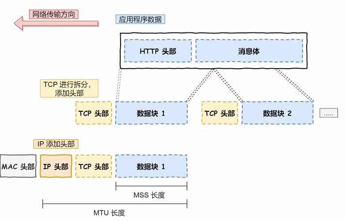
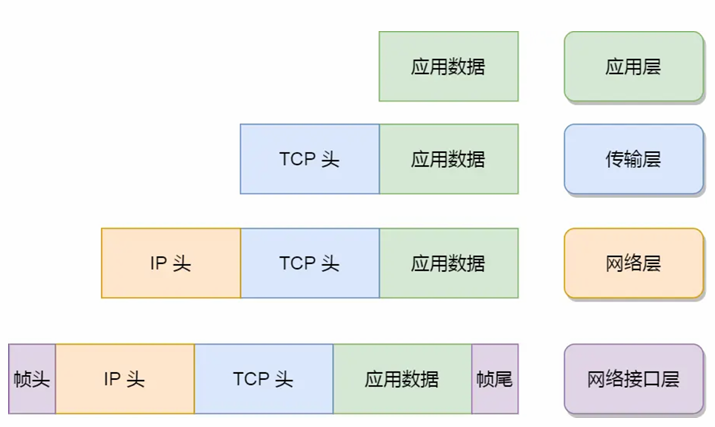
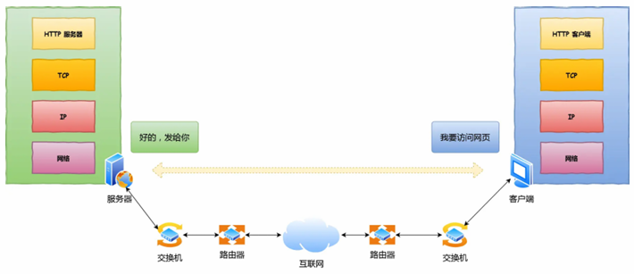
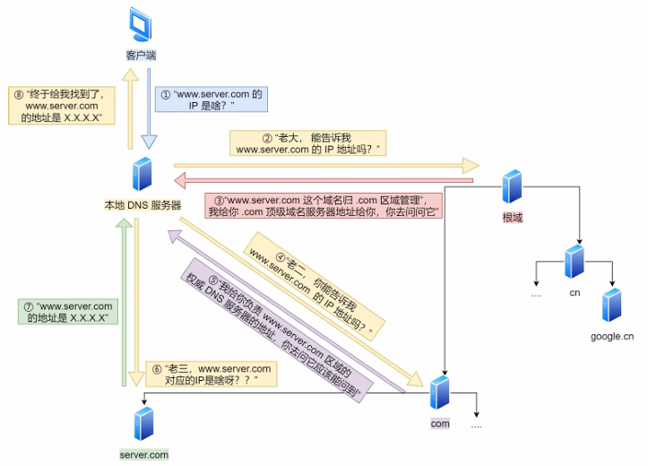

这部分使用 知识概述+面试答题 的方式去简述一个个的问题，如果想详细的了解这些知识，建议去b站或者小林coding上详细的学习

包括以下三个问题：

1. TCP/IP网络模型有哪几层

2. 键入网址到网页显示期间发生了什么

3. Linux系统如何收发网络包的

# TCP/IP网络模型有哪几层

问法：请你简述一下通用网络模型、请你介绍一下xx层

## 一 为什么要有网络模型

在面试中我会这样介绍（网络通信的情况+网络协议的作用）：

1. 同一台设备上**进程间**的通信方式有管道、消息队列、共享内存、信号等
2. 而不同设备上的进程间通信就需要网络通信 ，而为了兼容不同设备、系统和应用，就要协商出一个统一的协议
3. 这个协议是分层的，本质上是通过分层来逐层实现泛用和统一

## 二 每一层的主要作用、解决的问题、数据格式、协议简介、重点

### 简要介绍

在面试中我会这样介绍（总介绍 每一层作用+数据包封装形式和作用+重点或协议）：

1. TCP网络模型是网络中最常见的模型，区别于OSI基础模型，TCP/IP模型从上到下由应用层、传输层、网络层、网络接口层四层组成。数据从上到下逐层封装，从下到上逐层解封，下面是我从上到下的简要理解
2. 【用户态、不关心传输、端口】用户能直接接触到的是应用层，这一层直接**为应用进程提供服务**而**不关心数据是如何传输的**，应用层工作在操作系统的**用户态**（也是唯一工作在用户态的层），使用**端口号**标定各个服务的运行端口方便**寻址**访问，这一层的数据单位是报文，关键设备是网关，常见协议是Http、Telnet和DNS等
3. 【TCP三大作用、UDP简评、超MSS分段】传输层接收应用层的数据包，为应用层提供网络支持，主要协议有TCP和UDP，数据单位是**段/数据报**、主要实现端到端连接管理，传输层的报文中会携带端口号。TCP（传输控制协议）保证数据包可靠的传递给接收方，主要特性有**流量控制、超时重传和拥塞控制**；TCP在传递数据包时，如果数据包超过了**MSS**（TCP最大报文段）就会将数据包分成一个个**TCP段**。UDP只简单的负责发送数据包，**不保证数据包是否能抵达对方**，其实时性和传输效率优于TCP（UDP实现可靠传输的话需要将TCP的特性应用在应用层上）
4. 【IP协议的数据包、寻址和路由】网络层负责数据从一个设备到另一个设备的**实际传输**，网络层最常见的是IP协议（主要作用有寻址和数据包封装），⼀般⽤ IP 地址给设备进⾏编号（对于IPv4协议  IP地址共 32 位  分成四段  使用子网掩码实现网络号和主机号的区分），IP 协议会将传输层的报⽂作为数据部分，再加上IP包头组装成IP报⽂；如果 IP 报⽂⼤⼩超过 MTU（以太⽹中⼀般为 1500 字节）就会再次进⾏分⽚； IP 协议还有另⼀个重要的能⼒就是路由，作⽤是告诉我们去往下⼀个⽬的地该朝哪个⽅向⾛，路由则是根据「下⼀个⽬的地」 选择路径。寻址更像在导航，路由更像在操作⽅向盘。
5. ⽹络接⼝层在 IP 头部的前⾯加上 MAC 头部，并封装成数据帧发送到⽹络上；主要为⽹络层提供「链路级别」传输的服务，负责在同一广播域下传递数据包，⼯作在⽹卡这个层次，依赖ARP协议（IP→MAC），不可路由。

### 重点提要

TCP/IP模型是互联网的基础架构，它将网络通信过程分为4个层次（有时分为5层）。理解TCP/IP模型的关键是掌握各层的分工协作关系，以及数据从高层到低层的**封装过程**和**反向的解封装过程**。以下是各层的核心要点（过一下就行）：

#### 数据包

下面这幅图写的是报文到传输层到数据层封装的顺序，注意一下MSS和MTU指的是哪一部分，注意一下MAC、IO、TCP等头部封装时添加的顺序

结合这个图想一下多层模型是如何去封装数据包的：

#### 核心对比

| 层         | 寻址方式 | 数据单位  | 关键设备      | 主要功能             |
| ---------- | -------- | --------- | ------------- | -------------------- |
| 应用层     | 端口号   | 报文      | 网关          | 应用程序间通信       |
| 传输层     | 端口号   | 段/数据报 | -             | 端到端连接管理       |
| 网络层     | IP地址   | 数据包    | 路由器        | 路由选择和分组转发   |
| 数据链路层 | MAC地址  | 帧        | 交换机/网桥   | 局域网内数据传输     |
| 物理层     | -        | 比特      | 集线器/中继器 | 物理介质上的比特传输 |

# 键入网址到网页显示期间发生了什么

上个问题我们明确了静态的网络的层级结构以及数据包的结构，下面我们站在动态的角度思考一下(这部分我建议可以去看一下up主 技术蛋老师 的视频，讲的比较清楚)

## 简要介绍

1. 【浏览器解析】第一步是浏览器解析URL，解析出应用层协议（http/https）、服务器名称、资源路径或者服务名称等,接下来浏览器根据这些信息来⽣成 HTTP 请求消息
2. 【DNS解析】第二步，浏览器会委托操作系统将消息发送给服务器，在此之前需要查询服务器域名对应的 IP 地址，在此之前如果服务器是域名的话就需要查询DNS服务器来找到对应的IP地址
3. 【协议栈】获取IP之后，浏览器通过调⽤ Socket 库，来委托协议栈⼯作。协议栈上半部分使用TCP或者UDP协议来接收上传的数据包并且加上TCP头等封装；之后下半部分

## 重点提要

### 报文结构

### 域名

#### 域名系统

1. DNS 中的域名都是⽤句点来分隔的，⽐如  www.server.com ，这⾥的句点代表了不同层次之间的界限。 在域名中，越靠右的位置表示其层级越⾼。
2. 实际上域名最后还有⼀个点，⽐如  www.server.com. ，这个最后的⼀个点代表根域名。 也就是. 根域是在最顶层，它的下⼀层就是 .com 顶级域，再下⾯是 server.com 。 所以域名的层级关系类似⼀个树状结构：
   - 根 DNS 服务器（.） （树的根节点）
   - 顶级域 DNS 服务器（.com） 
   - 权威 DNS 服务器（server.com）

#### 域名解析过程

主要看一下前面括号里面的概括

##### **基本寻址**

1. 【客户端发送DNS请求**给本地**】客户端⾸先会发出⼀个 DNS 请求，问 www.server.com 的 IP 是啥，并发给本地 DNS 服务器（也就 是客户端的 TCP/IP 设置中填写的 DNS 服务器地址）。 
2. 【本地找不到的话问根】本地域名服务器收到客户端的请求后，如果缓存⾥的表格能找到 www.server.com，则它直接返回 IP  地址。如果没有，本地 DNS 会去问它的根域名服务器：“⽼⼤， 能告诉我 www.server.com 的 IP 地 址吗？” 根域名服务器是最⾼层次的，它不直接⽤于域名解析，但能指明⼀条道路。
3. 【根回复对应的顶级服务器地址（根不会直接解析出IP）】根 DNS 收到来⾃本地 DNS 的请求后，发现后置是 .com，说：“www.server.com 这个域名归 .com  区域管理”，我给你 .com 顶级域名服务器地址给你，你去问问它吧。” 
4. 【本地根据根给的地址问顶级】本地 DNS 收到顶级域名服务器的地址后，发起请求问“⽼⼆， 你能告诉我 www.server.com  的 IP 地 址吗？” 
5. 【顶级回复对应的权威服务器地址】顶级域名服务器说：“我给你负责 www.server.com 区域的权威 DNS 服务器的地址，你去问它应该能 问到”。 
6. 【本地根据顶级给的地址问权威】本地 DNS 于是转向问权威 DNS 服务器：“⽼三，www.server.com对应的IP是啥呀？” server.com 的 权威 DNS 服务器，它是域名解析结果的原出处。为啥叫权威呢？就是我的域名我做主。 
7. 【权威回复对应IP】权威 DNS 服务器查询后将对应的 IP 地址 X.X.X.X 告诉本地 DNS。 
8. 本地 DNS 再将 IP 地址返回客户端，客户端和⽬标建⽴连接。

也就是说，DNS解析中三层服务器的设计思想就是不告诉你具体IP，但是给你介绍谁知道这个IP。

##### 本地缓存

1. **浏览器**会先看**⾃身**有没有对这个域名的缓存，如果有，就直接返回，如果没有，就去问操作系统
2. **操作系统**也会去看⾃⼰的**缓存**，如果有，就直接返回，如果没有，再去 hosts ⽂件看，
3. **host文件**同理，也没有的话才会去问「本地  DNS 服务器」

### 协议栈

1. 协议栈上⾯的部分会向下⾯的部分委托⼯作
2. 应⽤程序（浏览器）通过调⽤ Socket 库，来委托协议栈⼯作，协议栈的上半部分有两块，分别是负责收发数据的 TCP 和 UDP 协议，这两个传输协议会接受应⽤层的委托执⾏收发数据的操作
3. 协议栈的下⾯⼀半是⽤ IP 协议控制⽹络包收发操作，在互联⽹上传数据时，数据会被切分成⼀块块的⽹络 包，⽽将⽹络包发送给对⽅的操作就是由 IP 负责的，IP协议包括下面两个协议：
   - ICMP ⽤于告知⽹络包传送过程中产⽣的错误以及各种控制信息。
   -  ARP ⽤于根据 IP 地址查询相应的以太⽹ MAC 地址。
4. IP 下⾯的⽹卡驱动程序负责控制⽹卡硬件，⽽最下⾯的⽹卡则负责完成实际的收发操作，也就是对⽹线中 的信号执⾏发送和接收操作

### TCP

#### 报文结构

1. **源端口号**和**目标端口号**是用来确认数据报应该发给哪个应用。  
2. 包的**32位序号**，解决包乱序的问题。  
3. **32位确认号**，确认发出去对方**是否有收到**，如果没有收到就应该重新发送，直到送达，这个是为了解决**丢包的问题**。  
4. **状态位**（**SYN** 是发起一个连接，**ACK** 是回复，**RST** 是重新连接，**FIN** 是结束）。TCP 是面向连接的，因而双方要维护连接的状态，这些带状态位的包的发送，会引起双方的状态变更。  
5. **窗口大小**。TCP 要做**流量控制**，通信双方各声明一个窗口（缓存大小），标识自己当前能够的处理能力，别发送的太快，撑死我，也别发的太慢，饿死我。除了做流量控制以外，TCP还会做**拥塞控制**，对于真正的通路堵车不堵车，它无能为力，唯一能做的就是控制自己，也即控制发送的速度。  
6. 此外**4位首部长度**（表示TCP头部的大小，以4字节为单位）、  **保留6位**（预留字段，未使用时必须置0）、**校验和**（用于检测TCP头部和数据在传输过程中是否出错）、**紧急指针**（配合URG标志位使用，指示紧急数据的末尾位置[仅在URG=1时有效]）

#### 三次握手

#### 数据分割

# Linux系统如何收发网络包的

